# 📘 배열 목차
1. 배열의 이해

2. 다차원 배열


---


# 🎯 학습 목표
- 배열의 개념과 필요성을 이해하고 설명할 수 있다.
- 배열 선언·생성·초기화 문법을 정확히 사용할 수 있다.
- 인덱스 접근 및 length를 활용하여 배열을 읽고, 수정할 수 있다.
- 배열의 복사와 비교 방법을 적용할 수 있다.
- 다차원 배열을 이해하고 설명할 수 있다.


---


# ✅ 배열의 이해

## 📌 배열(Array)이란?
- 동일한 데이터 타입의 값(**0개 이상**)들을 저장하기 위한 자료구조
- 인덱스를 이용하여 각 요소에 접근할 수 있음
- 고정된 크기 (생성된 배열의 크기를 바꿀 수 없음)
- 메모리에 연속적으로 저장됨


## 📌 배열 선언
- 데이터타입[] 배열이름
- 데이터타입 배열이름[ ]

| 자료형     | 배열 이름(변수명) | 배열 선언문               |
| ------- | ---------- | -------------------- |
| int     | intArray   | int[] intArray;      |
| char    | charArray  | char[] charArray;    |
| boolean | boolArray  | boolean[] boolArray; |
| String  | strArray   | String[] strArray;   |
| float   | floatArray | float[] floatArray;  |


## 📌 배열의 생성과 초기화
- 자료형[] 배열이름 = new 자료형[길이];  // 배열 생성(자료형의 초기값으로 초기화)
- 자료형[] 배열이름 = new 자료형[] {값1, 값2, 값3, 값4};  // 배열 생성 및 값 초기화
- 자료형[] 배열이름 = {값1, 값2, 값3, 값4};  // 선언과 동시에 초기화

| 자료형              | 기본값      | 비고           |
| ---------------- | -------- | ------------ |
| boolean          | false    |              |
| char             | ‘\u0000’ | 공백 문자(널 문자)  |
| byte, short, int | 0        |              |
| long             | 0L       |              |
| float            | 0.0f     |              |
| double           | 0.0      |              |
| 참조형 변수           | null     | 아무것도 참조하지 않음 |


## 📌 배열의 메모리 생성과정
- 예시 1
```java
int[] nums = new int[3];
nums[0] = 11;
nums[1] = 7;
nums[2] = 23;
```
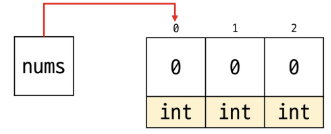

- 예시 2
```java
int[] nums = new int[] {27, 54, 83};
```
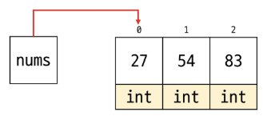


## 📌 배열의 메모리 생성과정 – 문자열 배열
- 예시 1
```java
String[] names = new String[3];
names[0] = "lime";
names[1] = "pear";
names[2] = "grape";
```
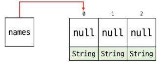

- 예시 2
```java
String[] names = new String[] {"pig", "cow", "fish"};
```
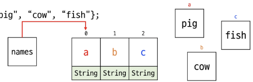


## 📌 배열의 인덱스
- [] 안에 숫자를 넣어 해당 위치의 요소에 접근 가능
- 인덱스는 0부터 시작
    - 예) 길이 5 → 인덱스: 0, 1, 2, 3, 4
- 음수 사용 불가
- 범위를 벗어나면 예외 발생
```php
예외 예시
Exception in thread "main" java.lang.ArrayIndexOutOfBoundsException:
Index -1 out of bounds for length 1
    at Hello.main(Hello.java:25)
```
- `.length` 로 배열의 길이 조회 가능


## 📌 배열의 순회 (for)
- 반복문을 이용하여 배열의 요소를 순회할 수 있음
```java
int intArray[] = {1, 3, 5, 7, 9};

for(int i = 0; i < intArray.length; i++){
    System.out.println(intArray[i]);
}
```


## 📌 배열의 순회 (for-each)
- 가독성이 개선된 반복문으로, 배열 및 Collections에서 사용가능
- index 대신 요소(element) 직접 접근하는 변수 제공
- 값이 복사되므로 read-only 느낌

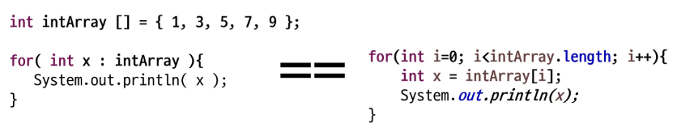


## 📌 배열의 출력
- 반복문 사용 가능
- java.util.Arrays 클래스의 메서드 toString() 활용
    - Array.toString(배열명) => [요소1, 요소2, 요소3, ...] 식으로 출력
```java
int[] numbers = {10, 20, 30};
System.out.println(Arrays.toString(numbers)); 
// 출력: [10, 20, 30]
```


## 📌 얕은 복사 (Shallow Copy)
- 객체 내부의 참조 변수만 복사 → 같은 배열을 공유
- 원복 객체와 복사본이 같은 참조를 가리키므로, 하나를 수정하면 다른 객체에도 영향 미침

```java
import java.util.Arrays;

public class ShallowCopyExample {
    public static void main(String[] args) {

        int[] original = {1, 2, 3};
        int[] shallowCopy = original;   // 얕은 복사 (참조 공유)

        shallowCopy[0] = 10;

        System.out.println("원본 배열: " + Arrays.toString(original));   // [10, 2, 3]
        System.out.println("복사본 배열: " + Arrays.toString(shallowCopy)); // [10, 2, 3]
    }
}
```


## 📌 깊은 복사 (Deep Copy)
- 객체의 모든 필드 값을 새로 복사하여 독립적인 객체를 생성
- 원본 객체와 복사본은 완전히 별개의 메모리 공간을 가지므로, 한 객체의 변경이 다른 객체에 영향X

```java
import java.util.Arrays;

public class DeepCopyExample {
    public static void main(String[] args) {
        int[] original = {1, 2, 3};
        int[] deepCopy = Arrays.copyOf(original, original.length);  // 깊은 복사

        deepCopy[0] = 10;

        System.out.println("원본 배열: " + Arrays.toString(original)); // [1, 2, 3]
        System.out.println("복사본 배열: " + Arrays.toString(deepCopy)); // [10, 2, 3]
    }
}
```


## 📌 배열의 복사
- 배열은 고정된 크기이므로 배열의 크기를 변경하고 싶다면 새로운 배열을 생성하여 복사해야함

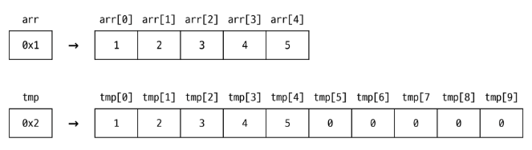


## 📌 배열의 복사 메서드
- Arrays.copyOf() : 배열을 복사하여 새로운 배열을 생성
```java
int[] original = {10, 20, 30};
int[] copy = Arrays.copyOf(original, original.length);
System.out.println(Arrays.toString(copy));  // 출력: [10, 20, 30]
```

- Arrays.copyOfRange() : 배열의 특정 범위를 복사하여 새로운 배열을 생성
```java
int[] numbers = {10, 20, 30, 40, 50};
int[] subArray = Arrays.copyOfRange(numbers, 1, 4);
System.out.println(Arrays.toString(subArray));  // 출력: [20, 30, 40]
```

- System.arraycopy(Object src, int srcPos, Object dest, int destPos, int length)


## 📝 배열 실습 문제 Q1 : 최대, 최소, 합, 평균 구하기
- 다음 주어진 int 배열에서 최대값, 최소값, 전체 합, 전체 평균을 구하여 출력하세요.

```java
int[] nums = {64, 53, 123, 23, 444, 98, 12};

/*
최소값: 12
최대값: 444
합계: 817
평균: 116.7142857143
*/
```


## 📝 배열 실습 문제 Q2 : 빈도수 구하기
- 0 ~ 9 까지의 값으로만 이루어져 있는 배열이 주어졌을 때, 각각의 0 ~ 9까지의 값이 몇 번 등장하였는지를 출력하세요. (단, 한 번도 등장하지 않은 숫자는 출력하지 않습니다.)
```java
int[] intArray = {3, 7, 2, 5, 7, 7, 9, 2, 8, 1, 1, 5, 3};

/*
1 : 2번
2 : 2번
3 : 2번
5 : 2번
7 : 3번
8 : 1번
9 : 1번
*/
```


## 📝 배열 실습 문제 Q3 : 같은 배열? 다른 배열?
- 두 개의 배열이 주어졌을 때 같은 배열이라면 “같습니다”, 다른 배열이라면 “다릅니다”를 출력하세요.
```java
//1번 : 같습니다.
int[] arr1 = {1,2,3,4,5};
int[] arr2 = {1,2,3,4,5};

//2번 : 다릅니다.
String[] arr3 = {“pig”, “cow”, “fish”};
String[] arr4 = {“pig”, “dog”, “cat”};
```


---


# ✅ 다차원 배열


## 📌 다차원 배열(Multidimensional Array)
- 배열 안에 또 다른 배열을 포함하는 구조
- 일반적으로 2차원 배열(행렬 형태)가 많지만 3차원 이상도 가능
- 표 형태 혹은 복잡한 계층 구조를 표현할 때 유용

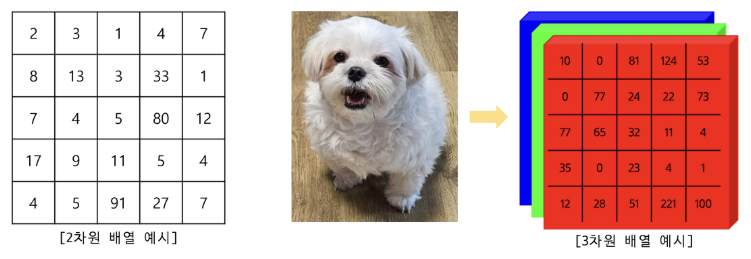

- 배열 객체의 참조 값을 요소로 갖는 배열
- 2차원 배열은 배열 요소로 1차원 배열의 참조를 가지는 배열
- 3차원 배열은 배열 요소로 2차원 배열의 참조를 가지는 배열
- …
- n차원 배열은 배열의 요소로 n-1차원 배열의 참조를 가지는 배열
- n차원 배열의 요소에 접근하기 위해서는 n개의 인덱스가 필요


## 📌 2차원 배열
- 배열의 각 요소가 또 다른 1차원 배열을 가리킴
- 행(row)과 열(column)의 구조 / 테이블 구조 / 좌표 평면 구조 등
- 2차원 배열의 각 요소(배열)는 크기는 일정해야 하는가? (O / X)


## 📌 2차원 배열 선언
- 데이터타입[ ][ ] 배열이름 / int[][] arr1 = new int[3][3];
- 데이터타입 배열이름[ ][ ] / int[] arr2[] = new int[3][3];
- 데이터타입[ ] 배열이름[ ] / int arr3[][] = new int[3][3];


## 📌 2차원 배열 초기화
- 크기만 지정 : new 데이터타입[1차원 배열 개수(행의 수)][1차원 배열 크기(열의 수)]
- 비정형 배열 : new 데이터타입[1차원 배열 개수(행의 수)][ ]
- 값으로 초기화
    ```java
    new 데이터타입[][] {
        { 첫번째 1차원 배열의 초기값 },
        { 두번째 1차원 배열의 초기값 },
        …
    }
    데이터타입[][] 배열이름 = {
        { 첫번째 1차원 배열의 초기값 },
        { 두번째 1차원 배열의 초기값 },
        …
    }
    ```


## 📌 2차원 배열 인덱스
- 인덱스를 이용하여 요소에 접근
- arr[행 인덱스][열 인덱스]

```java
int[][] scores = {{90,80,85,100},
                  {100,80,75,60},
                  {50,90,100,100}};
```
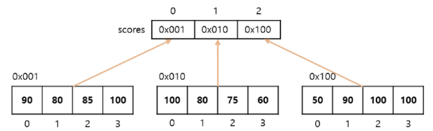

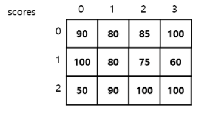


## 📌2차원 배열 메모리 구조
```java
int [][] arr = new int[2][];

arr[0] = new int[3];

arr[1][1] = 100;

arr[1] = new int[3];

arr[1][2] = 1000;
```
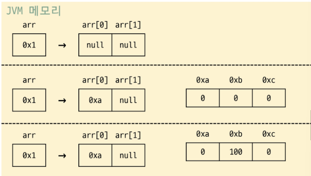


## 📝 2차원 배열 실습 문제 Q1 : 3의 배수는 나의 적!
- 주어진 2차원 배열의 전체 요소를 순회하면서 해당 값이 3의 배수라면 0으로 바꾸어 출력하세요.

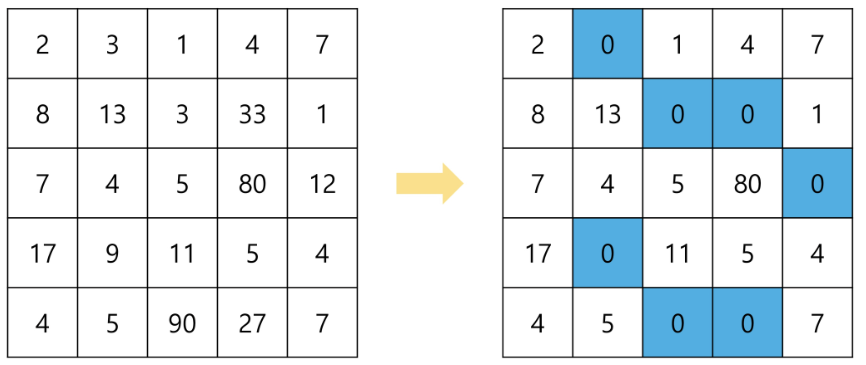


## 📝 2차원 배열 실습 문제 Q2 : 가장 시끄러운 자리는?
- 주어진 2차원 배열의 요소는 해당 자리에서 발생되는 소음의 정도이다.
그러나 해당 자리의 진짜 소음은 자리의 소음과 (상,하,좌,우) + 모양의 소음 또한 같이 측정해야 한다.
가장 시끄러운 자리는 어디인가?

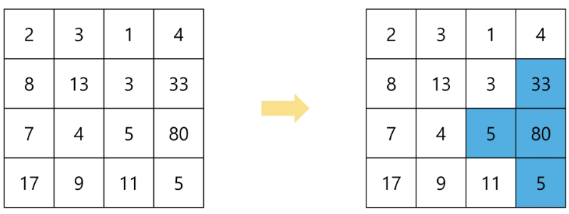


## 📌3차원 배열 선언
- 데이터타입[][][] 배열이름


## 📌 3차원 배열 생성
- 배열이름 = new 데이터타입[크기a][크기b][크기c];
    - 크기 a: 3차원 배열의 크기
    - 크기 b: 2차원 배열의 크기
    - 크기 c: 1차원 배열의 크기

- 배열이름 = new 데이터타입[크기a][][];
- 배열이름 = new 데이터타입[][][] { 3차원 배열의 초기값 }


## 📌 다음 2x2 픽셀 이미지를 배열로 저장한다면?

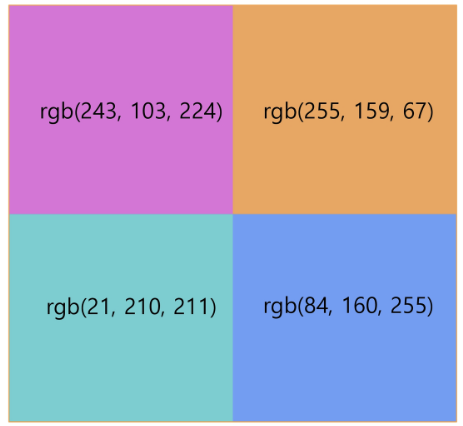

```java
// 2x2 이미지의 RGB 값 저장을 위한 3차원 배열 생성
int[][][] image = new int[2][2][3];

// 각 픽셀의 RGB 값 할당
// 픽셀 (0,0)
image[0][0][0] = 243; // Red
image[0][0][1] = 103; // Green
image[0][0][2] = 224; // Blue

// 픽셀 (0,1)
image[0][1][0] = 255; // Red
image[0][1][1] = 159; // Green
image[0][1][2] = 67;  // Blue

// 픽셀 (1,0)
image[1][0][0] = 21;  // Red
image[1][0][1] = 210; // Green
image[1][0][2] = 211; // Blue

// 픽셀 (1,1)
image[1][1][0] = 84;  // Red
image[1][1][1] = 160; // Green
image[1][1][2] = 255; // Blue

// 이미지의 RGB 값 출력
for (int i = 0; i < image.length; i++) {
    for (int j = 0; j < image[i].length; j++) {
        System.out.println("Pixel (" + i + ", " + j + ") - " +
        "R: " + image[i][j][0] + ", " +
        "G: " + image[i][j][1] + ", " +
        "B: " + image[i][j][2]);
    }
}
```