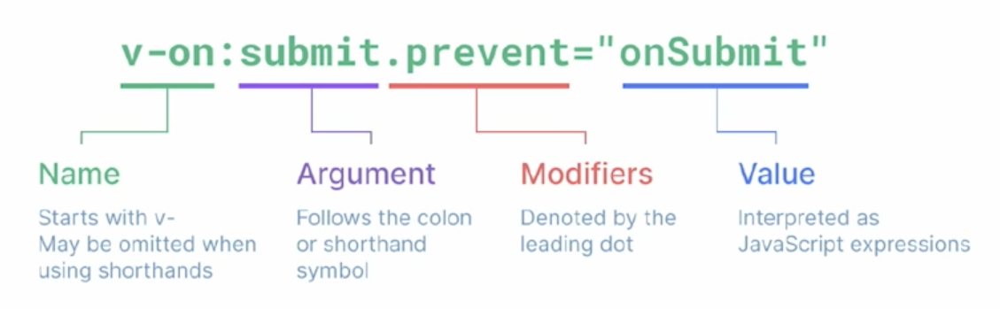

# ✅ Template Syntax

- Vue는 DOM을 컴포넌트 인스턴스의 데이터에 **선언적으로 바인딩**할 수 있는, HTML 기반 **템플릿 구문**을 사용
- Vue를 사용하면 JavaScript 데이터와 HTML 화면을 아주 쉽고 직관적인 방법으로 연결할 수 있음
- **선언적 바인딩**은 JavaScript 데이터(상태)가 바뀌면 DOM(화면)이 알아서 업데이트되는 것을 의미 
- **템플릿 구문**은 HTML에 Vue만의 특별한 문법을 추가해서 사용하는 것을 의미 


## Template Syntax 종류
- Text Interpolation
- Raw HTML
- Attribute Bindings
- JavaScript Expressions


### 1. Text Interpolation
- **데이터 바인딩**의 가장 기본적인 형태
- 이중 중괄호 구문 (콧수염 구문)을 사용
- 콧수염 구문은 해당 컴포넌트 인스턴스 msg 속성 값으로 대체
- msg 속성이 변경될 때마다 업데이트 됨

```html
<p>Message: {{ msg }}</p>
```

**※ 데이터 바인딩
: 자바스크립트 데이터와 HTML 화면을 동기화하여 연결하는 것**


### 2. Raw HTML
- 콧수염 구문은 데이터를 일반 텍스트로 해석하기 때문에 실제 HTML을 출력하려면 **v-html** 을 사용해야 함

```html
<div v-html="rawHtml"></div>
```
```js
const rawHtml = ref('<span style="color:red">This shold be red.</span>')
```

=> 권장하지 않음! -> 보안 위험 (XSS 공격)


### 3. Attribute Bindings
- 콧수염 구문은 HTML 속성 내에서 사용할 수 없기 때문에 **v-bind**를 사용
- HTML의 **id 속성 값**을 vue의 **dynamicId 속성**과 **동기화** 되도록 함
- 바인딩 값이 null이나 undefind인 경우, 해당 속성은 렌더링 요소에서 제거됨
```html
<div v-bind:id="dynamicId"></div>
```
```js
const dynamicId = ref('my-id')
```
```html
<div id="my-id"></div>
```


### 4. JavaScript Expressions
- Vue는 모든 데이터 바인딩 내에서 JavaScript 표현식의 모든 기능을 지원
- Vue 템플릿에서 **JavaScript 표현식**을 사용할 수 있는 위치
    1. 콧수염 구문 내부
    2. 모든 디렉티브의 속성 값('v-'로 시작하는 특수 속성)

```html
{{ number + 1 }}
{{ ok ? 'YES' : 'NO' }}
{{ message.split('').reverse().join('') }}
```

```html
<div v-bind:id="`list-${id}`"></div>
```

* JavaScript 표현식
: 하나의 값으로 평가(계산)될 수 있는 모든 코드 조각


## Expressions 주의사항
- 각 바인딩에는 **하나의 단일 표현식만 포함**될 수 있음
    - 표현식은 값으로 평가할 수 있는 코드 조각(return 뒤에 사용할 수 있는 코드여야 함)
- 작동하지 않는 경우 

```html
<!-- 표현식이 아닌 선언식 -->
{{ const number = 1 }}

<!-- 제어문은 삼항 표현식을 사용해야 함 -->
{{ if (ok) {return message} }}
```


---


# ✅ Directive

- 'v-' 접두사가 있는 특수 속성
- DOM 요소에 특정 반응형 동작을 적용하는 명령어
- v-if는 조건에 따라 렌더링하고, v-for는 배열을 반복 출력하는 등 다양한 반응형 동작을 연결함
- 즉, JavaScript 로직을 HTML 템플릿 안에서 선언적으로 사용하여, 코드를 깔끔하고 직권적으로 유지하는 데 도움을 주는 Vue의 강력한 도구


## Directive 특징
- Directive의 속성 값은 단일 JavaScript 표현식이어야 함(v-for, v-on 제외)
- 표현식 값(ex: "seen")이 변경될 때 DOM에 반응적으로 업데이트를 적용
- 예시 
```HTML
<p v-if="seen">Hi There</p>
```

+ 디렉티브 안에는 if문 같은 문장을 쓸 수 없음. 하나의 값으로 귀결되는 표현식만 가능
* 문자열 리터럴을 값으로 주려면 "문자열"처럼, 따옴표로 한 번 더 감싸야 함


## Directive 전체 구문
- Name(이름): Directive의 핵심 이름으로, 어떤 정류의 기능을 수행할지를 의미
- Argument(전달 인자): Directive가 '무엇에 대해' 동작할 지 알려주는 구체적인 대상
- Modifiers(수식어): 점으로 표시되는 특별한 접미사로, Directive의 기본 동작을 수정할 수 있음
- Value(값): Directive에 연결될 JavaScript 표현식

  


## Directive: "Arguments"
- 일부 directive는 directive 뒤에 콜론(":")으로 표시되는 인자를 사용할 수 있음
- 아래 예시의 href는 HTML <a> 요소의 **href 속성 값** 을 myUrl 값에 바인딩 하도록 하는 v-bind의 인자

```html
<a v-bind:href="myUrl">Link</a>
``` 

- 아래 예시의 **click**은 이벤트 수신할 이벤트 이름을 작성하는 v-on의 인자

```html
<button v-on:click="doSomething">Button</button>
```


## Directive: "Modifiers"
- **".(dot)"**로 표시되는 특수 접미사로, directive가 특별한 방식으로 바인딩되어야 함을 나타냄
- 예시의 .prevent는 발생한 이벤트에서 event.preventDefault()를 호출하도록 v-on에 지시하는 modifier

```html
<form v-on:submit.prevent="onSubmit">
    <input type="submit">
</form>
```

* 하나의 디렉티브에 여러 수식어를 이어서 붙일 수 있음 (예: @click.stop.prevent)


## Built-in Directives
- v-text
- v-show
- v-if
- v-for
- ...
- https://vuejs.org/api/built-in-directives.html


---


# ✅ Dynamically data binding
## 📌 v-bind
- 하나 이상의 속성 또는 컴포넌트 데이터를 표현식에 동적으로 바인딩
- v-bind는 HTML 태그의 속성을 Vue의 데이터와 실시간으로 연결해 동적으로 제어하는 directive
- 데이터 값에 따라 이미지, 스타일, 클래스 등을 자유롭게 변경할 수 있음


## Directive
1. Attribute Bindings
2. Class and Style Bindings


---


# ✅ Attribute Bindings (속성 바인딩)
- HTML의 속성 값을 Vue의 상태 속성 값과 동기화

```html
<!-- v-bind.html -->


<a v-bind:href="myUrl">Move to url</a>
```

- v-bind shorthand(약어)
    - ':' (colon)

```html

<a :href="myUrl">Move to url</a>
```


## Dynamic attribute name (동적 인자 이름)
- 대괄호([])로 감싸서 directive argument에 JavaScript 표현식을 사용할 수 있음
- 표현식에 따라 동적으로 평가된 값이 최종 argument 값으로 사용됨

```html
<button :[key]="myValue"></button>
```

* **대괄호 안에 작성하는 이름은 반드시 소문자로만 구성 가능** 
(브라우저가 속성 이름을 소문자로 강제 변환하기 때문)

* 대괄호 안의 값이 null이면, 해당 속성이나 이벤트 리스너가 아예 제거되는 특징이 있음
* 대괄호 안에는 띄어쓰기나 따옴표를 쓸 수 없음

### 🎁 완전 쉬운 비유

- 동적 인자는 **“속성 이름 자체를 변수로 바꾸는 기능”**
  - 평소: “문 이름이 ‘class’인 방에 들어가!”
  - **동적 인자: “어떤 방에 들어갈지는 변수에 적혀 있어!”**


## Attribute Bindings 예시

```html
<!-- v-bind.html -->

<a v-bind:href="myUrl">Move to url</a>


<a :href="myUrl">Move to url</a>

<p :[dynamicattr]="dynamicValue"></p>
```

```js
const app = createApp({
  setup() {
    const imageSrc = ref('https://picsum.photos/200')
    const myUrl = ref('https://www.google.co.kr/')
    const dynamicattr = ref('title')
    const dynamicValue = ref('Hello Vue.js')

    return {
      imageSrc,
      myUrl,
      dynamicattr,
      dynamicValue
    }
  }
})

app.mount('#app')
```


---


# ✅ Class and Style Bindings (클래스와 스타일 바인딩)
- class와 style은 모두 HTML 속성이므로 다른 속성과 마찬가지로 v-bind를 사용하여 동적으로 문자열 값을 할당할 수 있음
- Vue는 class 및 style 속성 값을 v-bind로 사용할 때 **객체** 또는 **배열**을 활용하여 작성할 수 있도록 함
  -> 단순히 문자열 연결을 사용하여 이러한 값을 생성하는 것을 번거롭고 오류가 발생하기가 쉽기 때문


## Class and Style Bindings가 가능한 경우
- Binding HTML Classes
  - 1.1 Binding to Objects
  - 1.2 Binding to Arrays

- Binding Inline Style
  - 2.1 Binding to Objects
  - 2.2 Biding to Arrays 


## 1.1 Binding HTML Classes: Biding to **Objects** (1)
### ✔️ 객체(Object)로 클래스 바인딩 - 기본원리

- **`:class="{ 클래스명: 조건 }"` → 조건이 true면 클래스가 붙고, false면 안 붙는다.**
- 객체를 :class에 전달하여 클래스를 동적으로 전환할 수 있음
- 예시 1
    - isActive의 Boolean 값에 의해 active 클래스의 존재가 결정됨

    ```html
    <!-- binding-html-classes.html -->
    <script>
    const isActive = ref(true)
    </script>
    ```

    ```html
    <div :class="{ active: isActive }">Text</div>
    ```

    - 변환 후 실제로 보이는 태그 모습
    ```html
    <div class='active'>Text</div>
    ```


## 1.1 Binding HTML Classes: Biding to **Objects** (2)
### ✔️ 여러 개의 클래스 동시 처리

- 객체에 더 많은 필드를 포함하여 여러 클래스 속성과 함께 사용 가능
- 예시 2
    - :class directive를 일반 클래스 속성과 함께 사용 가능

    ```js
    const isActive = ref(false)
    const hasInfo = ref(true)
    ```

    ```html
    <div class='static' :class="{ active: isActive, 'text-primary': hasInfo }">Text</div>
    ```

    - 변환 후 실제로 보이는 태그 모습
    ```html
    <div class='static text-primary'>Text</div>
    ```

## 1.1 Binding HTML Classes: Biding to **Objects** (3)
### ✔️ 클래스를 객체 변수에 담아서 넘기기

- inline 방식이 아닌 반응형 변수를 활용해 객체를 한 번에 작성하는 방법
- 예시 3
    ```js
    const is Active = ref(false)
    const hasInfo = ref(true)

    // ref는 반응 객체의 속성으로 액세스되거나 변경될 때 자동으로 unwrap
    const classObj = ref({
        active: isActive,
        'text-primary': hasInfo
    })
    ```

    ```html
    <div class='static' :class='classObj'>Text</div>
    ```

    - 변환 후 실제로 보이는 태그 모습
    ```html
    <div class="static text-primary">Text</div>
    ```


## 1.2 Binding HTML Classes: Biding to **Arrays** (1)
- :class를 배열에 바인딩하여 클래스 목록을 적용할 수 있음
- 예시 1
    ```js
    const activeClass = ref('active')
    const infoClass = ref('text-primary')
    ```

    ```html
    <div class="active text-primary">Text</div>
    ```


## 1.2 Binding HTML Classes: Biding to **Arrays** (2)
- 배열 구문 내에서 객체 구문을 사용하는 경우
- 예시 2
    ```js
    const isActive = ref(false)
    const infoClass = ref('text-primary')
    ```

    ```html
    <div :class="[{ active: isActive }, infoClass]">Text</div>
    ```

    - 변환 후 실제로 보이는 태그 모습
    ```html
    <div class='text-primary'>Text</div>
    ```


## 2.1 Binding HTML Styles: Biding to **Objects** (1)
- :style은 HTML의 style 속성에 JavaScript 객체를 바인딩하는 것을 지원
- 예시 1
    ```html
    <!-- binding-inline-styles.html -->
    const activeColor = ref('crimson')
    const fontSize = ref(50)
    ```

    ```html
    <div :style="{ color: activeColor, fontSize: fontSize + 'px' }">Text</div>
    ```

    - 변환 후 실제로 보이는 태그 모습
    ```html
    <div style='color: crimson; font-size: 50px;'>Text</div>
    ```


## 2.1 Binding inline Styles: Biding to **Objects** (2)    
- 실제 CSS에서 사용하는 것처럼 :style은 kebab-cased 키 문자열도 지원 (단, camelCase 작성을 권장)
- 예시 2
    ```html
    <div :style="{ color: activeColor, 'font-size': fontSize + 'px' }">Text</div>
    ```

    - 변환 후 실제로 보이는 태그 모습
    ```html
    <div style='color: crimson; font-size: 50px;'>Text</div>
    ```


## 2.1 Binding inline Styles: Biding to **Objects** (3)
- inline 방식이 아닌 반응형 변수를 활용해 객체를 한 번에 작성하는 방법
- 예시 3
    ```js
    const activeColor = ref('crimson')
    const fontSize = ref(50)
    const styleObj = ref({
      color: activeColor,
      fontSize: fontSize.value + 'px'
    })
    ```

    ```html
    <div :style="styleObj">Text</div>
    ```

    - 변환 후 실제로 보이는 태그 모습
    ```html
    <div :style="color: crimson; font-size: 50px;">Text</div>
    ```


   ## 2.2 Binding inline Styles: Biding to **Arrays** (1)
   - 여러 스타일 객체를 배열에 작성해서 :style을 바인딩할 수 있음
   - 작성한 객체는 병합되어 동일한 요소에 적용
   - 예시
        ```js
        const styleObj2 = ref({
          color: 'blue',
          border: '1px solid black'
        })
        ```

        ```html
        <div :style="[styleObj, styleObj2]">Text</div>
        ```

        - 변환 후 실제로 보이는 태그 모습
        ```html
        <div :style="=color: blue; font-size: 50px; border: 1px solid black;">Text</div>
        ```

## v-bind 종합   
- 해당 링크 참고
    - https://vuejs.org/api/built-in-directives.html#v-bind


---


# ✅ Event Handling

## v-on
- DOM 요소에 이벤트 리스너를 연결 및 수신

- 버튼 클릭, 키보드 입력 등 사용자의 이벤트를 감지하고, 지정된 코드를 실행시키는 디렉티브임.
- 사용자와 웹 페이지가 서로 상호작용할 수 있도록 만드는 핵심적인 역할.
- ‘버튼을 누르면 A를 실행하세요.’ 와 같은 로직을 구현.


## v-on 구성
• DOM 요소에 이벤트 리스너를 연결 및 수신
```js
v-on:event="handler"
```

- v-on shorthand (약어)
    - ‘@’
    ```js
    @event="handler"
    ```

- handler 종류
    1. Inline handlers : 이벤트가 트리거 될 때 실행될 JavaScript 코드
    2. Method handlers : 컴포넌트에 정의된 메서드 이름


## 1. Inline handlers

- Inline handlers는 주로 간단한 로직에 사용
- 복잡한 표현식이 들어가면 템플릿이 지저분해지고 코드를 이해하기 어려워짐
- 재사용이 불가능해 유지보수가 어려움

```js
//  event-handling.html

const count = ref(0)
```
```html
<button @click="count++">Add 1</button>
<p>Count: {{ count }}</p>
```


## 2. Method Handlers (1/2)
- 메서드 핸들러는 setup에 정의된 메서드를 호출하는 방식
- 로직이 복잡할 경우 Method를 분리하면 템플릿이 간결해지고 코드를 재사용하기 좋음
- Inline handlers로는 불가능한 대부분의 상황에서 사용

```js
const increase = function () {
  count.value += 1
}
```
```html
<button @click="increase">Hello</button>
```


## 2. Method Handlers (2/2)
- **@click="myFunc"** 처럼 괄호 없이 메서드 이름만 연결하면 핸들러의 첫 번째 인자로 DOM의 event 객체가 자동 전달됨

```js
const name = ref('Alice')
const myFunc = function (event) {
  console.log(event)
  console.log(event.currentTarget)
  console.log(`Hello ${name.value}!`)
}
```
```html
<button @click="myFunc">Hello</button>
```


## 사용자 지정 인자 전달
- 기본 event 대신 사용자 지정 인자를 전달할 수도 있음

```js
const greeting = function (message) {
  console.log(message)
}
```
```html
<button @click="greeting('hello')">Say hello</button>
<button @click="greeting('bye')">Say bye</button>
```
=> event 객체도 같이 받고 싶을 때는?


## Inline Handlers에서의 event 인자 접근 (1/2)

### ✔️ 이벤트 객체란? 
- 브라우저에서 버튼을 클릭하면 **브라우저는 “어떤 요소를 눌렀고, 위치는 어디였고, 무슨 키가 눌렸는지”** 같은 정보를 이벤트 객체로 담아서 핸들러에게 전달해.
---

- Inline Handlers에서 원래 DOM 이벤트에 접근하기
- **$event** 변수를 사용하여 메서드에 전달

```js
const warning = function (message, event) {
  console.log(message)
  console.log(event)
}
```
```html
<button @click="warning('경고입니다', $event)">Warning</button>
```


## Inline Handlers에서의 event 인자 접근 (2/2)
- $event 변수를 전달하는 **위치는 상관 없음**
```js
const danger = function (msg1, event, msg2) {
  console.log(msg1)
  console.log(event)
  console.log(msg2)
}
```
```html
<button @click="danger('위험', $event, '합니다')">Danger</button>
```


---


# ✅ Modifiers

## Event Modifiers
- Vue는 Event Modifiers를 제공하여, event.preventDefault()와 같은 코드를 메서드 안에 직접 작성할 필요가 없도록 함.
- 대신 stop, prevent, self 등 다양한 modifiers를 제공  
- 이는 메서드 로직을 순수하게 데이터 관련 처리에만 집중시키기 위함  

```html
<form @submit.prevent="onSubmit">...</form>
```
```html
<a @click.stop.prevent="onLink">...</a>
```

**※ Modifiers는 chained 되게끔 작성할 수 있으며, 이때는 작성된 순서로 실행되기 때문에 작성 순서에 유의**


## Event Modifiers 예시1  
- form 요소에서 submit 이벤트가 발생하면, submit 이벤트의 기본 동작을 취소하고 onSubmit 메서드를 호출  

```html
<form @submit.prevent="onSubmit">
  <input type="submit">
</form>
```
```js
const onSubmit = function () {
  console.log('onSubmit')
}
```


## Event Modifiers 예시2 (1/3)
- 첫번째 a 태그 클릭 시  
    - 버블링 현상으로 인해 detectBubble 메서드가 호출되고 google 페이지로 이동  

```html
<div v-on:click="detectBubble">
  <a href="https://www.google.com/">onLink</a><br>
  <a @click.prevent="onLink" href="https://www.google.com/">onLink</a><br>
  <a @click.stop.prevent="onLink" href="https://www.google.com/">onLink</a>
</div>
```
```js
const detectBubble = function () {
  console.log('detectBubble')
}

const onLink = function () {
  console.log('onLink')
}
```

### ✔️ 한눈에 정리
| 코드                                    | 부모 클릭(detectBubble) 실행? | a 링크 이동?      | onLink 실행? |
| ------------------------------------- | ----------------------- | ------------- | ---------- |
| `<a href="...">`               | ✔️ O (버블링됨)             | ✔️ O          | ❌ X        |
| `@click.prevent="onLink"`     | ✔️ O (버블링됨)             | ❌ X (prevent) | ✔️ O       |
|`@click.stop.prevent="onLink"` | ❌ X (stop)              | ❌ X (prevent) | ✔️ O       |


## Event Modifiers 예시2 (2/3)
- 두번째 a 태그 클릭 시  
    - click 이벤트로 인해 onLink 메서드 호출  
    - 버블링 현상으로 인해 detectBubble 메서드가 호출  
    - prevent modifier로 인해 a 태그 이벤트의 기본 동작이 취소되어 페이지가 이동하지 않음  

```html
<div v-on:click="detectBubble">
  <a href="https://www.google.com/">onLink</a><br>
  <a @click.prevent="onLink" href="https://www.google.com/">onLink</a><br>
  <a @click.stop.prevent="onLink" href="https://www.google.com/">onLink</a>
</div>
```

(출력)
```
onLink  
detectBubble
```


## Event Modifiers 예시2 (3/3)
- 세번째 a 태그 클릭 시  
    - click 이벤트로 인해 onLink 메서드 호출  
    - stop modifier로 인해 버블링 현상이 중단되어 detectBubble 메서드가 호출되지 않음  
- prevent modifier로 인해 a 태그 이벤트의 기본 동작이 취소되어 페이지가 이동하지 않음  

```html
<div v-on:click="detectBubble">
  <a href="https://www.google.com/">onLink</a><br>
  <a @click.prevent="onLink" href="https://www.google.com/">onLink</a><br>
  <a @click.stop.prevent="onLink" href="https://www.google.com/">onLink</a>
</div>
```

(출력)
```
onLink
```


## Key Modifiers  
- **특정 키를 누르거나(keydown), 뗐을 때(keyup) 발생**
- 키보드 이벤트를 수신할 때 특정 키에 관한 별도 modifiers를 사용할 수 있음  
- 예시1  
    - **Enter 키가 입력** 되었을 때만 onSubmit 이벤트를 호출하기  
    ```js
    <input @keyup.enter="onSubmit">
    ```

- 예시2  
    - **Ctrl + Enter**로 댓글 등록하기  
    ```html
    <textarea @keydown.ctrl.enter="submitComment"></textarea>
    ```


## v-on 종합  
- https://vuejs.org/api/built-in-directives.html#v-on


---


# ✅ Form Input Bindings

## Form Input Bindings (폼 입력 바인딩)
 - form을 처리할 때 사용자가 input에 입력하는 값을 실시간으로 JavaScript 상태에 동기화해야 하는 경우 (양방향 바인딩)

- 양방향 바인딩 방법
    1. v-bind와 v-on을 함께 사용
    2. **v-model 사용**
  
  ```
  - 사용자가 입력한 걸 받을 때
  ```

---


# ✅ v-vinde with v-on

## 1. v-bind와 v-on을 함께 사용
1. v-bind로 input 요소의 value 속성을 반응형 변수에 연결
2. v-on으로 input 이벤트가 발생할 때마다, input의 현재 값을 반응형 변수에 저장

```html
<!-- form-input-bindings.html -->
<script>
  const { createApp, ref } = Vue

  const inputText1 = ref('')

  const onInput = function (event) {
    inputText1.value = event.currentTarget.value
  }
</script>
```
```html
<p>{{ inputText1 }}</p>
<input :value="inputText1" @input="onInput">
```


---


# ✅ v-model

## 정의 
- **form input 요소 또는 컴포넌트에서 양방향 바인딩**을 만듦

### ※ 양방향 바인딩: JS -> HTML & JS <- HTML
### ※ 사용자의 입력이 있는 곳(input, textArea, select...)에서만 활용 가능!!

- v-model은 input과 같은 폼 요소의 값과 Vue의 데이터를 실시간으로 동기화시키는 directive임.
- 사용자의 입력이 즉시 데이터에 반영되고, 데이터의 변경이 즉시 화면에 반영되는 양방향 연결을 만드는 핵심적인 역할.
- '이 input의 값은 항상 이 데이터와 같아야 한다'와 같은 동기화 규칙을 구현함.


## v-model
- 사용자 입력 데이터와 반응형 변수를 실시간 동기화
```js
const inputText2 = ref('')

<p>{{ inputText2 }}</p>
<input v-model="inputText2">
```

- TIP
    - IME가 필요한 언어(한국어, 중국어, 일본어 등)의 경우 v-model이 제대로 업데이트되지 않습니다.
    - 해당 언어에 대해 올바르게 응답하려면 v-bind와 v-on 방법을 사용해야 합니다.


---


# ✅ v-model 활용

## v-model과 다양한 입력(input) 양식
- v-model은 단순 Text input 뿐만 아니라 다양한 타입의 사용자 입력 방식과 함께 사용 가능
    - Checkbox
    - Select
    - Radio
    - textarea
    - …


## Checkbox 활용 (1/2)
### 1. 단일 체크박스와 boolean 값 활용

```js
<!-- v-model.html -->

const checked = ref(false)
```
```html
<input type="checkbox" id="checkbox" v-model="checked">
<label for="checkbox">{{ checked }}</label>
```


## Checkbox 활용 (2/2)
### 2. 여러 체크박스와 배열 활용
    - 초기 반응형 변수를 배열로 초기화
    - 해당 배열에는 현재 선택된 체크박스의 값이 포함됨
    - dkssud
```js
const checkedNames = ref([])
```
```html
<div>Checked names: {{ checkedNames }}</div>
<input type="checkbox" id="alice" value="Alice" v-model="checkedNames">
<label for="alice">Alice</label>
<input type="checkbox" id="bella" value="Bella" v-model="checkedNames">
<label for="bella">Bella</label>
```


## Select 활용
- select에서 v-model 표현식의 초기 값이 어떤 option과도 일치하지 않는 경우, select 요소는 “선택되지 않은(unselected)” 상태로 렌더링 됨

```js
const selected = ref('')
```
```html
<div>Selected: {{ selected }}</div>
<select v-model="selected">
    <option disabled value="">Please select one</option>
    <option>Alice</option>
    <option>Bella</option>
    <option>Cathy</option>
</select>
```


## v-model 종합
- https://vuejs.org/api/built-in-directives.html


---


# ✅ 접두어
## ‘$’ 접두어가 붙은 변수
- Vue 인스턴스 내에서 사용할 수 있도록 Vue가 제공하는 공용 프로퍼티
- 사용자가 지정한 반응형 변수나 메서드와 구분하기 위함

=> 주로 Vue 인스턴스 내부 상태를 다룰 때 사용

- TIP
    - 내가 만드는 데이터와 메서드 이름에 $나 _ 접두사를 사용하지 않는 것이 좋습니다.
    - ‘_’로 시작하는 속성은 내부용이므로 직접 사용하면 안됩니다. 예고 없이 변경될 수 있습니다.


---


# ✅ IME

## IME (Input Method Editor)
- 사용자가 입력 장치에서 기본적으로 사용할 수 없는 문자(비영어권 언어)를 입력할 수 있도록 하는 운영 체제 구성 프로그램

- 일반적으로 키보드 키보다 자모가 더 많은 언어에서 사용해야 함

- IME가 활성화된 상태(예: 한글 조합 중)에서 input 이벤트가 발생하는 방식과 v-model의 업데이트 방식이 충돌하여, 의도치 않은 동작이 발생할 수 있음

### TIP
    - v-model에 .lazy 수식을 붙이면 문제를 해결할 수 있지만 데이터가 실시간으로 반영되지 않고, 사용자가 입력을 마친 후 다른 곳을 클릭하는 등 포커스를 잃었을 때 한 번에 반영됨.


---


# 📚 총 정리

## 핵심 키워드

| 개념               | 설명                   | 예시                           |
| ---------------- | -------------------- | ---------------------------- |
| 템플릿 구문           | HTML 기반의 Vue 전용 구문   | `{{ msg }}`, `<div v-if>`    |
| 디렉티브 (Directive) | v- 접두사가 있는 특수 속성     | `<p v-if="seen">`            |
| v-bind           | HTML 속성을 동적으로 바인딩    | ``      |
| v-on             | DOM 이벤트 수신 및 핸들러 연결  | `<button @click="myFunc">`   |
| 이벤트 수식어          | 이벤트 동작을 제어하는 특별 접미사  | `@submit.prevent="onSubmit"` |
| v-model          | 폼 요소에 양방향 바인딩 설정     | `<input v-model="message">`  |
| 데이터 바인딩          | JS 데이터와 HTML 화면을 동기화 | `{{ msg }}`                  |


## 요약 및 정리 
- ### 템플릿 구문 (Template Syntax)
    - Vue가 HTML을 기반으로 사용하는 특별한 문법
    - 이를 통해 DOM과 Vue 인스턴스의 데이터를 선언적으로 연결(바인딩) 가능

- ### 디렉티브 (Directive)
    - v- 접두사가 붙는 특수 속성으로 DOM에 특정 반응형 동작을 적용하는 명령어
    - 디렉티브의 값으로는 단일 JavaScript 표현식만 사용 가능

- ### v-bind (데이터 바인딩)
    - v-bind는 HTML 태그의 속성 값을 Vue의 데이터와 동적으로 연결하는 디렉티브
    - 약어(shorthand)는 콜론(:)을 사용
    - v-bind를 사용하면 데이터 값의 변경에 따라 src, href 같은 HTML 속성을 실시간으로 업데이트 가능
    - 클래스와 스타일 바인딩
        - class와 style 속성에 v-bind를 사용하면, 객체나 배열을 활용해 여러 클래스와 스타일을 조건부로 동적 적용할 수 있어 편리


- ### v-on (이벤트 핸들링)
    - v-on은 click, submit과 같은 DOM 이벤트가 발생했을 때 지정된 JavaScript 코드를 실행하는 디렉티브
    - 약어(shorthand)는 @ 기호를 사용
    - 이벤트 수식어 (Modifiers)
        - `.prevent` (기본 동작 방지)
        - `.stop` (이벤트 전파 중단)
        
        -> 디렉티브 뒤에 점(.)으로 붙여 이벤트의 동작을 제어하는 특별한 접미사


- ### v-model (폼 입력 양방향 바인딩)
    - v-model은 `<input>`, `<textarea>`, `<select>` 같은 폼 요소에서 사용하며, 사용자의 입력과 Vue 데이터를 실시간으로 동기화하는 양방향 바인딩을 생성

    - 사용자가 입력 필드에 값을 입력하면 연결된 데이터가 즉시 업데이트되고, 데이터 값이 변경되면 입력 필드의 값도 자동으로 변경됨

    - 사실 v-model은 v-bind로 값을 연결하고 v-on으로 입력 이벤트를 감지하여 값을 변경하는 두 동작을 합친 축약