# 📘 목차 (Table of Contents)
| 대분류                        | 소분류                                                                                                                                                                 |
| -------------------------- | ------------------------------------------------------------------------------------------------------------------------------------------------------------------- |
| **Single-File Components** | - Component <br> - SFC 구성요소                                                                                                                                         |
| **SFC Build Tool**         | - Vite <br> - Vue Project <br> - NPM <br> - 모듈과 번들러                                                                                                                 |
| **Vue Project 구조**         | - 기본 구조 <br> - 패키지 관리                                                                                                                                               |
| **Vue Component 활용**       | **추가 주제** <br> - Virtual DOM <br> - Composition API & Option API <br><br> **참고** <br> - Single Root Element <br> - CSS scoped <br> - Scaffolding <br> - 패키지 관리 주의사항 |


---


# < Single File Component >


# ✅ Componenet

## 정의
- 사용 가능한 코드 블록

- 컴포넌트는 웹 페이지를 구성하는 재사용 가능한 UI로, 마치 '레고 블록'처럼 독립적인 기능 가짐.
- 이 '레고 블록'들을 조립하여 페이지를 만들기 때문에, 코드의 재사용성이 높아지고 유지보수가 매우 쉬워짐.


## Component 특징

- UI를 독립적이고 재사용 가능한 일부로 분할하고 각 부분을 개별적으로 다룰 수 있음

- 자연스럽게 애플리케이션은 중첩된 Component의 트리 형태로 구성됨
```php-template
<Root>
   ├── <Header>
   ├── <Main>
   │      ├── <Article> x2
   └── <Aside>
          ├── <Item> x3
```

> 💡 **UI (User Interface)**: 사용자가 마주하는 화면의 시각적 디자인


## Component 예시

- 웹 서비스는 여러 개의 Component로 이루어져 있음

    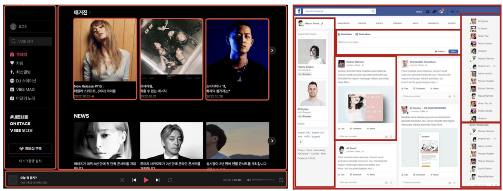


## Single-File Components (SFC)

- 컴포넌트의 템플릿, 로직 및 스타일을 하나의 파일로 묶어낸 특수한 파일 형식 (**.vue** 파일)

```markdown
- SFC는 하나의 .vue 파일 안에 컴포넌트의 HTML, JavaScript, CSS 코드를 모두 담는 Vue의 개발 방식임.
- 화면 구조를 담당하는 <template>, 로직을 담당하는 <script>, 스타일을 담당하는 <style> 세 부분으로 나뉨.
- 관련된 코드가 한곳에 모여 있어 컴포넌트 단위의 개발과 유지보수가 매우 편리하고 체계적으로 이루어짐.
```


## SFC 파일 예시

- Vue SFC는 HTML, CSS 및 JavaScript를 단일 파일로 합친 것
- `<template>`, `<script>` 및 `<style>` 블록은 하나의 파일에서 컴포넌트의 뷰, 로직 및 스타일을 독립적으로 배치

### 🔵 기본적인 SFC 구조
```vue
<!-- MyComponent.vue -->

<!-- 1. template => HTML 작성 -->
<template>
  <div class="greeting">{{ msg }}</div>
</template>

<!-- 2. script => 로직(JS) 영역 -->
<script setup>
import { ref } from 'vue'
const msg = ref('Hello World!')
</script>

<!-- 3. style => CSS 작성 -->
<style scoped>
.greeting {
  color: red;
}
</style>
```


---


# ✅ SFC 구성요소

## SFC 구성요소
- 각 *.vue 파일은 세 가지 유형의 최상위 언어 블록 `<template>`, `<script>`, `<style>`으로 구성됨

=> 언어 블록의 작성 순서는 상관 없으나 일반적으로
template → script → style 순서로 작성

```php
<template>
  <div class="greeting">{{ msg }}</div>
</template>

<script setup>
  import { ref } from 'vue'
  const msg = ref('Hello World!')
</script>

<style scoped>
  .greeting {
    color: red;
  }
</style>
```


## 1️⃣ `<template>` 블록

- 각 *.vue 파일은 최상위 `<template>` 블록을 하나만** 포함할 수 있음

```php
<template>
  <div class="greeting">{{ msg }}</div>
</template>

<script setup>
  import { ref } from 'vue'
  const msg = ref('Hello World!')
</script>

<style scoped>
  .greeting {
    color: red;
  }
</style>
```


## 2️⃣ `<script setup>` 블록

- 각 *.vue 파일은 *`<script setup>` 블록을 하나만** 포함할 수 있음 (일반 `<script>` 제외)

- 컴포넌트의 setup() 함수로 사용되며 컴포넌트의 각 인스턴스에 대해 실행

=> 변수 및 함수는 동일한 컴포넌트의 템플릿에서 자동으로 사용 가능

```php
<template>
  <div class="greeting">{{ msg }}</div>
</template>

<script setup>
  import { ref } from 'vue'
  const msg = ref('Hello World!')
</script>

<style scoped>
  .greeting {
    color: red;
  }
</style>
```


## 3️⃣ `<style scoped>` 블록

- *.vue 파일에는 여러 `<style>` 태그가 포함될 수 있음

- scoped가 지정되면 CSS는 현재 컴포넌트에만 적용됨

```php
<template>
  <div class="greeting">{{ msg }}</div>
</template>

<script setup>
  import { ref } from 'vue'
  const msg = ref('Hello World!')
</script>

<style scoped>  
  .greeting {
    color: red;
  }
</style>
```


## 컴포넌트 사용하기

- https://play.vuejs.org/ 에서 Vue 컴포넌트 코드 작성 및 미리보기

- Vue SFC는 일반적인 방법으로 실행할 수 없으며 컴파일러를 통해 컴파일된 후 빌드 되어야 함

=> 실제 프로젝트에서는 Vite와 같은 공식 빌드(build) 도구를 사용

> 💡 **빌드(build)**: 개발자가 쓴 소스 코드를 실행 가능한 파일로 변환하는 과정

※ 바로 이후에 자세히 진행


---


# < SFC build tool >

# ✅ Vite (비트)

## 정의
- 프론트 엔드 개발 도구로써 빠른 개발 환경을 위한 빌드 도구와 개발 서버를 제공

```markdown
- Vite는 Vue 프론트엔드 개발을 위한 **빌드** 도구입니다.

- 개발 서버의 시작 속도가 매우 빠르고 코드 수정 시 실시간에 가까운 즉각적인 반영을 보여줘,
비교할 수 없이 쾌적한 개발 경험을 제공합니다.

- 개발 시에는 파일을 필요할 때만 요청해 속도를 높이고,
배포 시에는 최적화된 파일로 묶어주는(번들링) 역할을 수행합니다.
```
https://vitejs.dev/

 
## Build 란?

- 프로젝트의 소스 코드를 최적화하고 *번들링(묶는 것)하여 배포할 수 있는 형식으로 변환하는 과정

- 개발 중에 사용되는 여러 소스 파일 및 리소스(JavaScript, CSS, 이미지 등)를 최적화된 형태로 조합하여 최종 소프트웨어 제품을 생성하는 것

➤ **Vite는 이러한 빌드 프로세스를 수행하는 데 사용되는 도구**

### 번들링: 여러 개로 흩어진 코드 파일을 하나로 합쳐주는 작업


---


# ✅ Vue Project

## Vue Project 생성 (1/7)
### ● Vue Project (Application) 생성 (Vite 기반 빌드)
```ruby
$ npm create vue@latest
```

### TIP
```markdown
- 문서나 튜토리얼에서 코드가 $로 시작한다면, 이는 터미널(Terminal) 또는 명령 프롬프트(Command Prompt)에 입력해야 할 명령어임을 나타냄.

- ‘latest’는 패키지의 가장 최신 안정화 버전(stable version)을 사용하겠다는 의미.
```


## Vue Project 생성 (2/7)

### ● 프로젝트명 설정
  - tab 클릭 시 기본 값 사용
  - enter 클릭 시 결정 후 진행
```sql
$ npm create vue@latest
Need to install the following packages:
  create-vue@3.17.0
Ok to proceed? (y) y

✔ Project name (target directory):
  vue-project
```
<그림6_Vue_Single File Components_Vue 프로젝트명 설정>


## Vue Project 생성 (3/7)

### ● 프로젝트에 추가 할 설정 선택
  - space 클릭 시 중복 선택 가능
  - enter 클릭 시 결정 후 진행

```pgsql
Select features to include in your project: (↑/↓ to navigate, space to select, a to toggle all, enter to confirm)
□ TypeScript
□ JSX Support
□ Router (SPA development)
□ Pinia (state management)
□ Vitest (unit testing)
□ End-to-End Testing
□ ESLint (error prevention)
□ Prettier (code formatting)
```
<그림7_Vue_Single File Components_Vue 프로젝트 추가 설정>


## Vue Project 생성 (4/7)

### ● 실험용 기능을 설치할 지 묻는 단계
  - 버그가 있거나 안정적이지 않을 수 있음
  - 해당 기능을 꼭 사용할 필요는 없음
```pgsql
Select experimental features to include in your project: (↑/↓ to navigate, space to select, a to toggle all, enter to confirm)
□ Oxlint (experimental)
□ rolldown-vite (experimental)  # 번들러
```
<그림8_Vue_Single File Components_Vue 프로젝트 실험용 기능 설정>


## Vue Project 생성 (5/7)

### ● 프로젝트 생성 완료
```mathematica
Scaffolding project in C:\Users\ ○○○ … ○○○ .
Done. Now run:

  cd vue-project
  npm install
  npm run dev

Optional: Initialize Git in your project directory with:

  git init && git add -A && git commit -m "initial commit"
```
<그림9_Vue_Single File Components_Vue 프로젝트 생성 완료>


## Vue Project 생성 (6/7)
### ●  프로젝트 폴더 이동
```powershell
$ cd vue-project
```

- 패키지 설치
```powershell
$ npm install
```
```rust
added 145 packages, and audited 146 packages in 12s

43 packages are looking for funding
  run `npm fund` for details

found 0 vulnerabilities
```
<그림10_Vue_Single File Components_패키지 설치 완료>


## Vue Project 생성 (7/7)

### ● Vue 프로젝트 서버 실행
```arduino
$ npm run dev
```
```pgsql
VITE v7.0.4  ready in 1216 ms

➜  Local:   http://localhost:5173/
➜  Network: use --host to expose
➜  Vue DevTools: Open http://localhost:5173/__devtools__/ as a separate window
➜  Vue DevTools: Press Alt(⌥)+Shift(⇧)+D in App to toggle the Vue DevTools
➜  press h + enter to show help
```
<그림11_Vue_Single File Components_Vue 프로젝트 서버 실행>


---


# ✅ NPM

## Node Package Manager

- Node.js의 기본 패키지 관리자 (python 'pip' 역할과 같음 !!)

```markdown
- NPM은 개발자들이 만든 JavaScript 패키지를 모아놓은 거대한 저장소이자, 그 패키지들을 쉽게 설치하고 관리할 수 있게 해주는 명령어 도구입니다.

- **npm install** 명령어 하나로 간편하게 다운로드하여 사용할 수 있습니다.

- 프로젝트에 사용된 모든 패키지들의 목록과 버전을 package.json 파일에 기록하여, 다른 사람과 협업하거나 다른 환경에서 작업할 때도 동일한 개발 환경을 쉽게 구축할 수 있도록 도와줍니다.
```


## Node JS

- Chrome의 V8 JavaScript 엔진을 기반으로 하는 Server-Side 실행 환경

- 브라우저 안에서만 동작할 수 있었던 JavaScript를 브라우저가 아닌 **서버 측에서도 실행**할 수 있게 함

    => 프론트엔드와 백엔드에서 동일한 언어로 개발할 수 있게 됨

- NPM을 활용해 수많은 오픈 소스 패키지와 라이브러리를 제공하여
개발자들이 손쉽게 코드를 공유하고 재사용할 수 있게 함

> 💡 **Server-Side**: 브라우저가 아닌 서버에서, 로직을 처리하는 것


---


# ✅ 모듈과 번들러

## Module
- **프로그램을 구성하는 독립적인 코드 블록 (*.js 파일)**

```markdown
- 개발하는 애플리케이션의 크기가 커지고 복잡해지면서 파일 하나에 모든 기능을 담기가 어려워졌고,
- 자연스럽게 파일을 여러 개로 분리하여 관리를 하게 되었습니다.
- 이때 **분리된 각 파일이 바로 모듈(module)** 입니다. ( .js 파일 하나가 하나의 모듈)
```


## Module의 한계

- 애플리케이션이 점점 더 발전함에 따라 처리해야 하는 JavaScript 모듈의 개수도 극적으로 증가

- 이러한 상황에서 성능 병목 현상이 발생하고 모듈 간의 **의존성(연결성)**이 깊어지면서
특정한 곳에서 발생한 문제가 어떤 모듈 간의 문제인지 파악하기 어려워 짐

- 복잡하고 깊은 모듈 간 의존성 문제를 해결하기 위한 도구가 필요

    ➤ **Bundler**

> 💡 **의존성**: 코드가 작동하기 위해 필요한 외부 라이브러리와의 관계


## node_modules의 의존성 깊이

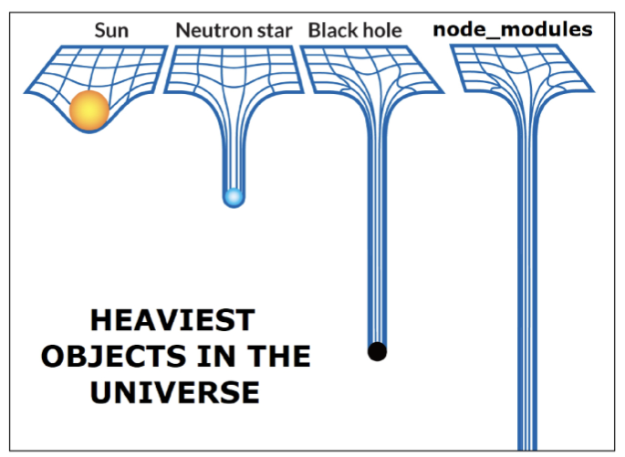

> 💡 **node_modules**: npm install로 설치한 모든 패키지들이 모여있는 저장소


## Bundler

- 여러 모듈과 파일을 하나(혹은 여러 개)의 번들로 **묶고** 최적화하여 사용할 수 있게 만들어주는 도구

```markdown
- Bundler는 여러 개로 나뉜 JavaScript 모듈 파일들을 하나의 파일로 합쳐주는 도구.
- 브라우저가 수많은 파일을 각각 요청하여 생기는 네트워크 부담을 줄이고,
코드를 브라우저가 이해할 수 있는 형태로 변환.
- 최종적으로 웹사이트의 로딩 속도를 높이고 성능을 최적화하는 역할.
```


## Bundler의 역할

- 의존성 관리, 코드 최적화, 리소스 관리 등
- Bundler가 하는 작업을 Bundling이라 함

**※ Vite는 Rollup이라는 Bundler를 사용하며 개발자가 별도로 기타 환경설정에 신경 쓰지 않도록 모두 설정해두고 있음**

### TIP
```
- 번들링의 핵심 목표는 여러 파일을 하나로 묶어 HTTP 요청을 줄여 웹 로딩 속도를 개선하는 것.
- JS뿐 아니라 CSS, 이미지 등 모든 정적 자원을 함께 처리하고, 최적화하는 역할.
- import하지 않은 코드는 '트리 쉐이킹'을 통해 최종 번들 파일에서 자동으로 제거됨.
```


---


# < Vue Project 구조 >

# ✅ 기본 구조

## Vue Project 기본 구조

1. public 디렉토리

2. src 디렉토리
    1. src/assets
    2. src/components
    3. src/App.vue
    4. src/main.js

3. index.html

4. 기타 설정 파일

5. 패키지 관리 파일
    1. package.json
    2. package-lock.json
    3. node_modules


## 1. public 디렉토리
- 주로 다음 정적 파일을 위치 시킴
    - 소스코드에서 참조되지 않는 코드 (**= 번들러로 합쳐질 필요 없는 파일**)
    - 항상 같은 이름을 갖는 코드
    - import 할 필요 없는 코드

- 항상 root 절대 경로를 사용하여 참조
    - public/icon.png는 소스 코드에서 /icon.png로 참조할 수 있음

https://vitejs.dev/guide/assets.html#the-public-directory


## 2. src 디렉토리
- 프로젝트의 **주요 소스 코드**를 포함하는 곳
- **실제로 우리가 작업**하게 될 대부분의 소스 코드가 위치
- 컴포넌트, 스타일, 라우팅 등 프로젝트의 **핵심 코드를 관리**

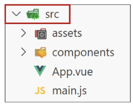


## 2.1 src/assets
- 프로젝트 내에서 사용되는 정적 자원 (이미지, 폰트, 스타일 시트 등)을 관리
- 컴포넌트 자체에서 참조하는 내부 파일을 저장하는데 사용
- 컴포넌트가 아닌 곳에서는 public 디렉토리에 위치한 파일을 사용

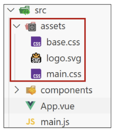


## 2.2 src/components
- 프로젝트의 주요 소스 코드를 포함하는 곳
- 실제로 우리가 작업하게 될 대부분의 소스 코드가 위치
- 컴포넌트, 스타일, 라우팅 등 프로젝트의 핵심 코드를 관리

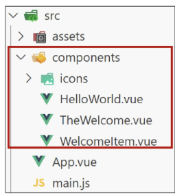


## ⭐ 2.3 src/App.vue 
- Vue 앱의 Root 컴포넌트
- 다른 하위 컴포넌트들을 포함
- 애플리케이션 전체의 레이아웃과 공통적인 요소를 정의

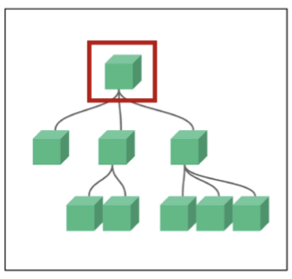  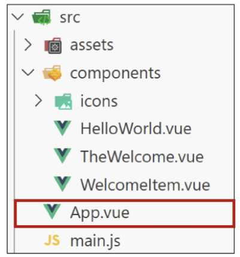


## 2.4 src/main.js
- Vue 애플리케이션을 초기화하고, App.vue를 DOM에 마운트하는 시작점
- 필요한 라이브러리를 import 하고 전역 설정을 수행

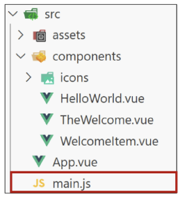


## 3. index.html
- Vue 앱의 **기본 HTML 파일** (실제로 user가 받는 html 파일)
- main.js에서 App.vue 컴포넌트를 렌더링하고, index.html 특정 위치를 마운트 시킴

    ➤ Vue 앱이 SPA인 이유 (**index.html 파일 하나로 이루어져있기 때문**)

- 필요한 스타일 시트, 스크립트 등의 외부 리소스를
로드 할 수 있음 (ex. bootstrap CDN)

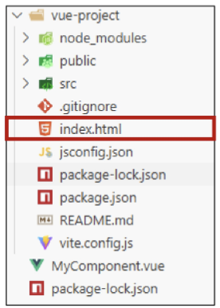

> 💡 **마운트**: 만들어진 앱을 HTML로 보여주는 것

> 💡 **SPA**: 하나의 페이지 안에서, 내용만 바꿔가며 보여주는 웹 앱


## 4. 기타 설정 파일
- ### jsconfig.json
    - 컴파일 옵션, 모듈 시스템 등 설정

- ### vite.config.js
    - Vite 프로젝트 설정 파일
    - 플러그인, 빌드 옵션, 개발 서버 설정 등

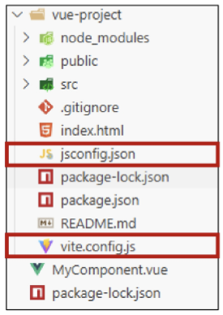

> 💡 **컴파일 옵션** : 디버깅, 최적화 등 컴파일의 세부 방식을 제어하는 명령어

> 💡 **플러그인** : 기존 프로그램에 새로운 기능을 추가하는 확장 프로그램


---


# ✅ 패키지 관리

## 5.1 package.json
- 프로젝트에 관한 기본 정보와 패키지 의존성을 정의하는 "설계도" 파일
(메타데이터 파일)
- 프로젝트가 어떤 패키지를 사용하고, 어떤 스크립트를 실행할 수 있는지 명시
- npm install 시 이를 참조하여 패키지를 설치
    - 어떤 패키지를 설치해야 하는지 결정하는 기준 제공

> 💡 **메타데이터** : 데이터를 설명해주는 데이터

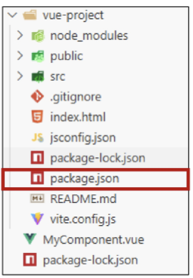


## 5.1 package.json 특징
- 프로젝트 메타 데이터
    - 프로젝트 이름, 버전, 스크립트 명령, 패키지 의존성 등의 정보가 명시됨
- 의존성(Dependencies) 목록
    - 어떤 패키지를 사용하는지, 어떤 버전 범위를 허용하는지를 기록

    ➤ "집을 짓기 전에 필요한 재료 목록과 건축 계획서"
(필요한 재료(패키지)와 대략적 규격(버전 범위)을 알려주는 문서)


## 5.2 package-lock.json
- package.json을 기반으로 실제 설치된 패키지들의 "정확한 버전 정보"를 기록하는 파일
- 실제로 어느 버전의 패키지가 설치되었는지 확정하고 기록
- 다른 환경에서도 동일한 패키지 구성을 재현 가능하게 함

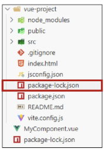


## 5.2 package-lock.json 특징
- ### 정확한 버전 고정
    - 프로젝트를 설치할 때 실제로 어떤 버전의 패키지가 설치되었는지를 기록
- ### 빌드 안정성 보장
    - 협업 또는 배포 환경에서, 모든 개발자가 동일한 패키지 버전을 사용하도록 보장
- ### 자동 관리
    - npm install 결과가 반영되어 매번 자동 업데이트

➤ "장바구니에 담긴 물건들의 정확한 브랜드와 생산일자가 적힌 구매 내역서"
(실제 구매된 물건(패키지)의 구체적 스펙을 담은 문서)


## 5.3 node_modules
- package.json과 package-lock.json에 따라 실제로 설치된 모든 패키지가 저장되는 곳
- 프로젝트 실행 시 필요한 모든 라이브러리와 코드 파일을 보관
- 애플리케이션 구동 시 참조되는 실제 데이터 저장소

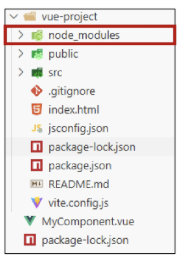


## 5.3 node_modules 특징
- npm install을 통해 설치된 모든 패키지(모듈)들이 실제로 저장
    - 개발 시 직접 수정할 필요는 없으며, npm install 시 자동 관리됨
        - 직접 수정하지 않고, 필요 시 npm install로 언제든 재생성 가능

- 용량이 매우 클 수 있으며, 협업 시 일반적으로 Git으로 추적하지 않음 (.gitignore에 포함)

➤ "계획서와 내역서대로 확보한 실제 건축 자재들이 쌓여 있는 창고"

(설계와 구매 목록을 바탕으로 실제 물리적 자재(파일)들이 모여 있는 장소)


## 5. 패키지 관리 정리

### ✔️ package.json
- 어떤 패키지가 필요하고 어떤 버전 범위를 허용할지 정의하는 “설계도”

### ✔️ package-lock.json
- 실제로 설치한 패키지의 정확한 버전을 기록하는 “상세 내역서”

### ✔️ node_modules
- 이 설계도와 내역서에 따라 내려 받은 실제 패키지 “자재 창고”


---


# ✅ Vue Componenet 활용

## 컴포넌트 사용 3단계
1. 사전준비
2. 컴포넌트 파일 생성
3. 컴포넌트 등록 (import)


## 1. 사전 준비
- 초기에 생성된 모든 컴포넌트 삭제 (App.vue 제외)
- App.vue 코드 초기화
```vue
<!-- App.vue -->

<template>
  <h1>App.vue</h1>
</template>

<script setup>
</script>
```


## 2. 컴포넌트 파일 생성
- MyComponent.vue 생성

### ▶️ '.vue' 는 component 안에 생성하면 됨 
### ▶️ vue component 기본구조 만들 때 **'v3s'** 치면 됨 !!

```vue
<!-- MyComponent.vue -->

<template>
  <div>
    <h2>MyComponent</h2>
  </div>
</template>

<script setup>
</script>
```


## 3. 컴포넌트 등록
- App 컴포넌트에 MyComponent를 등록
- App(부모) – MyComponent(자식) 관계 형성
- "**@**" → "**src/** */" 경로를 뜻하는 약어

```vue
<!-- App.vue -->

<template>
  <h1>App.vue</h1>
  <MyComponent />   // 2. 배치 (single 태그로 닫히는 것만!)
</template>

<script setup>
// import MyComponent from './components/MyComponent.vue'
import MyComponent from '@/components/MyComponent.vue' // 1. component 불러오기
</script>
```


## 결과 확인
- Vue dev tools를 사용해 컴포넌트 관계 확인 가능

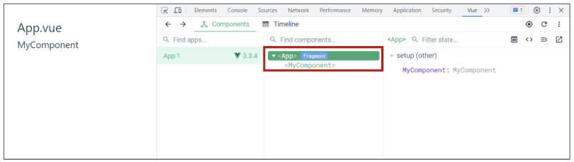


## 추가 하위 컴포넌트 등록 후 활용
- 컴포넌트의 재사용성 확인하기
- MyComponentItem은 MyComponent의 자식 컴포넌트

### 📄 MyComponentItem.vue
```vue
<!-- MyComponentItem.vue -->

<template>
  <p>MyComponentItem</p>
</template>
```

### 📄 MyComponent.vue 수정
```vue
<!-- MyComponent.vue -->

<template>
  <div>
    <h2>MyComponent</h2>
    <MyComponentItem />
    <MyComponentItem />
    <MyComponentItem />
  </div>
</template>
<script setup>
import MyComponentItem from '@/components/MyComponentItem.vue'
</script>
```

### 디렉토리 구조
```
components/
 ├── MyComponent.vue
 ├── MyComponentItem.vue
App.vue
```


## Component 이름 지정 스타일 가이드
- 스타일 가이드 살펴보기
- Vue 공식 스타일 가이드(Strongly Recommended 규칙)

🔗 https://vuejs.org/style-guide/rules-strongly-recommended.html


---


# ✅ Virtual DOM

## Vue 에서는 직접적으로 DOM에 접근하는 것을 권장하지 않고 있음
- JavaScript에서 사용하는 DOM 접근 관련 메서드 사용 금지
- querySelector, createElement, addEventListener 등

- Vue의 ref()와 Lifecycle Hooks 함수를 사용해 간접적으로 접근하여 조작할 것

    ➤ 이유는 **성능**과 **코드의 예측 가능성 극대화**를 위해서

➤ 이를 가능하게 하는 것이 **‘가상돔(Virtual DOM)’**


## Virtual DOM 개념
- 가상의 DOM을 메모리에 저장하고 실제 DOM과 동기화하는 프로그래밍 개념

```markdown
- Virtual DOM은 실제 DOM의 모습을 그대로 복사한, 메모리상에만 존재하는 **'가상 설계도'**입니다.
- 데이터가 변경되면, Vue는 실제 DOM을 바로 건드리지 않고
이 가상 설계도 위에서 변경 사항을 미리 시뮬레이션하고 차이점을 계산합니다.
- 그리고 계산된 최소한의 변경 사항만 실제 DOM에 딱 한 번 적용하므로, 불필요한 렌더링을 줄여 성능을 크게 향상시킵니다.
```


## Virtual DOM 
- 실제 DOM과의 변경 사항 비교를 통해 바뀐 부분만 실제 DOM에 적용하는 방식
- 웹 애플리케이션의 성능을 향상시키기 위한 Vue의 내부 렌더링 기술
```html
<!-- index.html -->

<!DOCTYPE html>
<html lang="en">
  <head>
    …
  </head>
  <body>
    <div id="app"></div>  <!-- Vue의 영역(Virtual DOM) -->
    <script type="module" src="/src/main.js"></script>
  </body>
</html>
```


## Virtual DOM 내부 렌더링 과정
1. 작성한 HTML 템플릿을 Virtual DOM을 그려내는 설계도(렌더 함수 코드)로 변환
2. 렌더 함수 코드를 바탕으로 Virtual DOM을 생성
3. Virtual DOM을 실제 DOM에 마운트
4. 컴포넌트의 데이터(반응형 상태)가 바뀔 때마다 새로운 가상돔을 만들어 이전과 비교하고 바뀐 부분만 효율적으로 찾아 실제 DOM을 업데이트

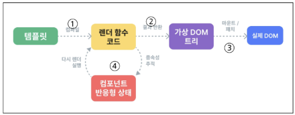


## Virtual DOM 패턴의 장점
1. 효율성
    - 실제 DOM 조작을 최소화하고, 변경된 부분만 업데이트하여 성능 향상
2. 반응성
    - 데이터의 변경을 감지하고 Virtual DOM을 효율적으로 갱신하여 UI 자동 업데이트
3. 추상화
    - 개발자는 실제 DOM 조작을 Vue에게 맡기고 컴포넌트와 템플릿을 활용하는 추상화된 방식으로 원하는 UI 구조를 구성하고 관리할 수 있음


## Virtual DOM 주의사항
### ❗실제 DOM에 직접 접근하지 말 것
    
- JavaScript에서 사용하는 DOM 접근 메서드 (querySelector, createElement, …) 사용 금지
- 아래와 같은 예측 불가능 문제 발생 가능
    1. 데이터와 화면의 불일치 (상태 불일치)
    2. 예측 불가능한 렌더링
    3. 코드의 복잡성 증가

➤ Vue의 ref()와 Lifecycle Hooks 함수를 사용해 간접적으로 접근하여 조작할 것


## 직접 DOM 엘리먼트에 접근해야 하는 경우
- ref 속성을 사용하면 특정 DOM 엘리먼트에 직접적인 참조를 얻을 수 있음
```vue
<template>
  <input ref="input">
</template>

<script setup>
import { ref, onMounted } from 'vue'

// 변수명은 템플릿 ref 값과 일치해야 함
const input = ref(null)

onMounted(() => {
  console.log(input.value)  // <input>
})
</script>
```


---


# ✅ Composition API & Option API

## Vue를 작성하는 2가지 스타일

### 1️⃣ Composition API
- import해서 가져온 API 함수들을 사용하여 컴포넌트의 로직을 정의
- **Vue3에서의 권장 방식**


```html
<template>
  <button @click="increment">{{ count }}</button>
</template>

<script setup>
import { ref, onMounted } from 'vue'

const count = ref(0)
function increment() { count.value++ }

onMounted(() => {
  console.log(`숫자 세기의 초기값은 ${ count.value }`)
})
</script>
```


### 2️⃣ Option API
- data, methods 및 mounted 같은 객체를 사용하여 컴포넌트의 로직을 정의
- Vue2에서의 작성 방식 (Vue3에서도 지원)

```html
<template>
  <button @click="increment">{{ count }}</button>
</template>

<script>
export default {
  data() { return { count: 0 }},
  methods: {
    increment() { this.count++ }
  },
  mounted() {
    console.log(`숫자 세기의 초기값은 ${ this.count }`)
  }
}
</script>
```


## API 별 권장 사항
- Composition API + SFC
    - 규모가 있는 앱의 전체를 구축하려는 경우
- Option API
    - 빌드 도구를 사용하지 않거나 복잡성이 낮은 프로젝트에서 사용하려는 경우

https://vuejs.org/guide/extras/composition-api-faq.html


---


# ✅ Single Root Element

## 모든 컴포넌트에는 최상단 HTML 요소가 작성되는 것이 권장
- 가독성, 스타일링, 명확한 컴포넌트 구조를 위해 각 컴포넌트에는 최상단 요소를 작성해야 함 (Single Root Element)

### ❌ bad
```html
<template>
  <h2>Heading</h2>
  <p>Paragraph</p>
  <p>Paragraph</p>
</template>
```
### ⬇️⬇️⬇️

### ✅ good
```html
<template>
  <div>
    <h2>Heading</h2>
    <p>Paragraph</p>
    <p>Paragraph</p>
  </div>
</template>
```


---


# ✅ CSS scoped

## CSS scoped 속성
- `<style scoped>`를 사용하면 해당 컴포넌트 내부의 스타일이 현재 컴포넌트 내부 요소에게만 적용되도록 범위를 제한하는 기능

    => **'.vue' 파일 내에서만 CSS 적용!!**

- 스타일이 컴포넌트 바깥으로 유출되거나, 다른 컴포넌트에서 정의한 스타일이 현재 컴포넌트를 침범하지 않도록 막아 줌

```php
<style scoped> </style>
```
- CSS Scoped를 사용하지 않는다면?
    - `<style>`에 scoped를 붙이지 않으면, 해당 스타일은 전역(모든 컴포넌트)에 영향을 미침
    - 예를 들어, 다른 컴포넌트에서도 div 태그를 사용했다면 그 스타일이 함께 적용됨


## 부모-자식 관계에서의 스타일 전파 (1/2)
- 일반적으로 scoped 스타일은 부모 컴포넌트의 스타일이 자식 컴포넌트에 영향을 미치지 않음
- 하지만 예외적으로 자식 컴포넌트의 **"최상위 요소(root element)"에는 부모 컴포넌트의 scoped 스타일도 영향**을 줄 수 있음

- 이는 부모가 자식 컴포넌트를 레이아웃 할 때 필요한 경우가 있기 때문
    - (예: 자식 컴포넌트의 외곽 박스 크기나 마진 조정)

➡ 즉, 자식 컴포넌트의 가장 바깥쪽을 감싸는 요소에 한해서는
부모의 scoped 스타일 적용이 의도적으로 허용되어 있음


## 부모-자식 관계에서의 스타일 전파 (2/2)
- 다음과 같이 App(부모) 컴포넌트에 적용한 스타일에 scoped가 작성되어 있지만, **MyComponent(자식)의 최상위 요소(div)는 부모와 본인의 CSS 모두의 영향을 받기 때문**에 부모 컴포넌트에 지정한 스타일이 적용됨

```html
<!-- App.vue -->
<template>
  <h1>App.vue</h1>
  <MyComponent />
</template>

<style scoped>
div {
  color: red;
}
</style>
```

```html
<!-- MyComponent.vue -->
<template>
  <div>
    <h2>MyComponent</h2>
  </div>
</template>
```

결과 화면:
```
App.vue
MyComponent
```


## CSS scoped를 적용한 이유
- Vue는 부모 컴포넌트가 자식 컴포넌트의 최상위 요소 스타일을 제어할 수 있어야 레이아웃(배치) 목적을 쉽게 달성할 수 있다고 판단했기 때문
- 이로 인해 자식 컴포넌트의 root element는
부모와 자식 모두의 scoped 스타일이 영향을 미칠 수 있음

## 그러나!
=> 최상위 App 컴포넌트에서 레이아웃 스타일을 전역적으로 구성할 수 있지만, 다른 모든 컴포넌트는 **범위가 지정된 스타일을 사용하는 것을 권장**

🔗 https://vuejs.org/style-guide/rules-essential.html#use-component-scoped-styling


---


# ✅ Scaffolding

## 스캐폴딩 (Scaffolding)
- 새로운 프로젝트나 모듈을 시작할 때, **초기 구조와 코드를 자동으로 생성하는 과정**

```
- 스캐폴딩은 새 건물을 지을 때 세우는 뼈대처럼, 새로운 프로젝트를 시작할 때 필요한 기본적인 파일과 폴더 구조를 자동으로 생성해주는 기능입니다.
- `npm create vue@latest` 같은 명령어로, 필요한 초기 파일, 코드가 자동으로 만들어집니다.
- 이를 통해 초기 설정 작업에 시간을 낭비하지 않고,
곧바로 개발에 집중할 수 있도록 도와줍니다.
```


## 관심사항의 분리가 파일 유형의 분리와 동일한 것이 아님
- “HTML/CSS/JS를 한 파일에 혼합하는 게 괜찮을까?”

➤ 프론트엔드 앱의 사용 목적이 점점 더 복잡해짐에 따라, 단순 파일 유형으로만 분리하게 될 경우 프로젝트의 목표를 달성하는데 도움이 되지 않게 됨

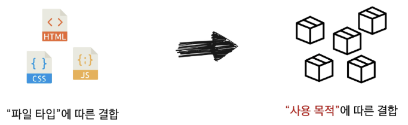


--


# ✅ 패키지 관리 주의사항

1. npm install을 입력하는 위치
    - 항상 프로젝트 루트 디렉토리(프로젝트를 생성한 폴더)에서 실행

2. node_modules 폴더 관리 주의
    - 필요할 때마다 npm install을 통해 재생성할 수 있으므로,
직접 수정하거나 Git으로 관리할 필요 없음

3. package.json과 package-lock.json 직접 편집 자제
    - npm install 패키지명 명령을 통해 자동 업데이트하는 것이 안전

4. 문제가 발생했을 때 재설치 고려
    - 패키지 버전 충돌이나 이상 동작이 의심될 때는 node_modules 폴더를 삭제한 뒤 다시 npm install을 실행


---


# 📚 총 정리

## 🔑 핵심 키워드

| 개념 | 설명 | 예시 |
|------|------|------|
| **컴포넌트** | 재사용 가능한 독립적인 UI 조각 | `<Header />`, `<ArticleList />` |
| **SFC** | .vue 확장자를 가진 단일 파일 컴포넌트 | `<template>`, `<script>`, `<style>` |
| **Vite** | 빠른 속도의 프론트엔드 빌드 도구 | `npm run dev`로 개발 서버 실행 |
| **NPM** | JS 패키지 관리자 및 저장소 | `npm install <package-name>` |
| **package.json** | 프로젝트 의존성 및 정보 명세 파일 | 패키지 목록, 버전 범위 기록 |


---


## 📝 요약 및 정리
### • Single-File Components (SFC)
- Vue에서 사용하는 특별한 파일 형식(.vue)으로,  
  컴포넌트 하나를 구성하는 HTML, JavaScript, CSS를 한 파일에 모두 담아 관리하는 방식


### • SFC의 구조
- `<template>`: 컴포넌트의 HTML 구조를 정의하는 부분
- `<script setup>`: 컴포넌트의 반응형 데이터와 로직(JavaScript)을 작성하는 부분
- `<style scoped>`: 컴포넌트의 CSS를 작성하는 부분


### • SFC 개발 환경
- `.vue` 파일은 브라우저가 직접 이해할 수 없으므로,  
  웹에서 실행 가능한 코드로 변환하는 빌드(build) 과정이 필요
- **Vite**: Vue의 공식 빌드 도구로, 빠른 개발 서버와 최적화된 빌드 기능 제공
- **NPM (Node Package Manager)**: Vue, Vite 등 프로젝트에 필요한 외부 패키지를 설치하고 관리하는 도구


### • 모듈과 번들러
- **모듈**: 기능을 기준으로 분리된 각각의 `.js` 파일
- **번들러**: 여러 모듈 파일들을 브라우저가 효율적으로 로드할 수 있도록  
  하나(또는 여러 개)의 파일로 묶어주는 도구


### • Vue 프로젝트

#### ✔ 프로젝트 생성
- 터미널에서 `npm create vue@latest` 명령어를 실행하여  
  프로젝트의 기본 구조(scaffolding)를 자동으로 생성

#### ✔ 패키지 관리
- **package.json**:  
  프로젝트의 이름, 버전 정보와 필요한 패키지들의 목록(의존성)을 기록하는 설계도
- **package-lock.json**:  
  package.json을 바탕으로 실제로 설치된 패키지들의 정확한 버전 정보를 기록하여  
  다른 환경에서도 동일한 개발 환경을 보장
- **node_modules**:  
  설치된 모든 패키지 파일들이 실제로 저장되는 폴더

#### ✔ 주요 구조
- **src/main.js**: Vue 앱 인스턴스를 생성하고 DOM에 마운트하는 프로젝트의 시작점
- **src/App.vue**: 모든 컴포넌트를 감싸는 최상위 루트 컴포넌트
- **src/components/**: 재사용할 자식 컴포넌트들을 저장하는 폴더


### • 가상돔 (Virtual DOM)

- 실제 DOM의 구조를 복사한 가상의 DOM을 메모리에 저장해두는 프로그래밍 개념
- 데이터가 변경되면, Vue는 실제 DOM을 직접 수정하는 대신  
  가상 DOM에서 변경 사항을 먼저 계산
- 그 후 계산된 최소한의 변경 사항만 실제 DOM에 딱 한 번 적용하여  
  불필요한 렌더링을 줄이고 성능을 크게 향상


---


### ‘집 짓기’ 비유로 학습을 시작했습니다.
#### 이제 우리는 SFC라는 '방'들을 조립하여 **하나의 ‘집’을 완성하는 방법을 압니다.

```md
<!-- MyComponent.vue -->

<template>
  <div><h2>여기는 침실입니다.</h2></div>
</template>
```
```md
<!-- App.vue -->

<template>
  <h1>우리 집 거실</h1>
  <MyComponent />
</template>

<script setup>
import MyComponent from '@/components/MyComponent.vue'
</script>
```
