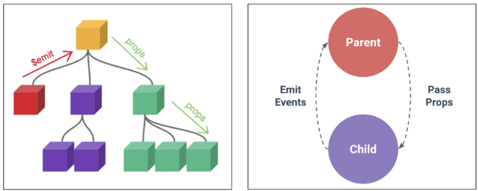
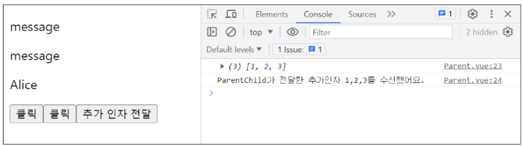
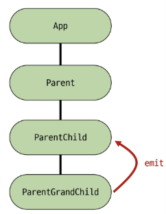
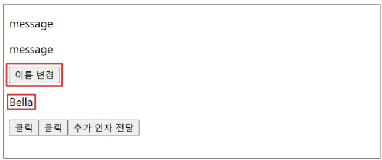

# 📘 목차 (Table of Contents)

### 1. Passing Props
- Props
- Props 선언
- Props 세부사항
- Props 활용

### 2. Component Events
- Emit
- 이벤트 발신 및 수신
- emit 이벤트 선언
- 이벤트 전달
- 이벤트 세부사항
- emit 이벤트 활용

### 3. 참고
- 정적 & 동적 props 주의사항
- Props & Emit 객체 선언 문법


---


# < 1. Passing Props >

# ✅ Props

## 🔵 동일한 데이터, 하지만 다른 컴포넌트 (1/2)
- 동일한 사진 데이터가 한 화면에 다양한 위치에서 여러 번 출력되고 있음
- 하지만 해당 페이지를 구성하는 컴포넌트가 여러 개라면 각 컴포넌트가 개별적으로 동일한 데이터를 관리해야 할까?
- 그렇다면 사진을 변경해야 할 때 모든 컴포넌트에 대해 변경 요청을 해야 함

👉 **“공통된 부모 컴포넌트에서 관리하자”**


## 🔵 동일한 데이터, 하지만 다른 컴포넌트 (2/2)
- 부모는 자식에게 데이터를 전달 (Pass **Props**)
- 자식은 자신에게 일어난 일을 부모에게 알림 (Emit event)


## 🔵 Props 란?

- **부모 컴포넌트로부터 자식 컴포넌트로 데이터를 전달**하는데 사용되는 사용자 지정 특성
```
- Props는 **부모 → 자식** 컴포넌트에게 데이터를 전달할 때 사용하는 특별한 속성.
- 데이터는 부모에서 자식으로 한 방향으로만 흐르며, 자식 컴포넌트는 전달받은 props를 직접 수정해서는 안 됩니다(읽기 전용).
- 이 방식을 통해 가능한 컴포넌트를 만들고, 부모가 어떤 데이터를 전달하느냐에 따라 자식의 내용과 모습을 다르게 설정할 수 있음.
```


## 🔵 Props 특징
- 부모의 데이터가 업데이트되면 자식에게 전달되지만, **그 반대는 불가능**
- 자식 컴포넌트 내부에서 props를 변경하려고 시도해서는 안 되며 불가능
- 부모 컴포넌트가 업데이트될 때마다 이를 사용하는 자식 컴포넌트의 (내려받는)모든 props가 최신 값으로 업데이트됨

👉 부모 컴포넌트에서만 변경하고, 자식은 자연스럽게 갱신

### 💡 TIP
- 자식이 부모 속성을 바꾸려면 props를 수정하지 말고,
**emit 이벤트**를 이용해 부모에게 알려야 함
- 객체/배열 props는 자식에서 내부 값을 바꾸면 부모의 원본도 바뀌니 매우 주의!


## 🔵 One-Way Data Flow
- 모든 props는 자식 속성과 부모 속성 사이에
**하향식 단방향 바인딩**(one-way-down binding) 을 형성함

- 단방향인 이유
    - 하위 컴포넌트가 실수로 상위 컴포넌트의 상태를 변경하지 못하게 하여 앱의 데이터 흐름을 이해하기 어렵게 만드는 것을 방지하기 위함 (무한 루프, 디버깅 난이도 증가 등)
    - 데이터 흐름의 **"일관성"** 및 **"예측 가능성"**을 높이기 위한 목적


---


# ✅ Props 선언

## 🔵사전 준비 (1/4)
1. vue 프로젝트 생성 ※ 04. vue-single file components:Vue project 참고
2. 초기 생성된 컴포넌트 모두 삭제 (App.vue 제외)
3. src/assets 내부 파일 모두 삭제
4. main.js 해당 코드 삭제
```js
// main.js

import './assets/main.css'
```
5. App > Parent > ParentChild 컴포넌트 관계 작성


## 🔵 사전 준비 (2/4)
- **App** > Parent > ParentChild 컴포넌트 관계 작성
    - App 컴포넌트 작성
```vue
<!-- App.vue -->

<template>
  <div>
    <Parent />
  </div>
</template>

<script setup>
  import Parent from '@/components/Parent.vue'
</script>
```


## 🔵 사전 준비 (3/4)
- App > **Parent** > ParentChild 컴포넌트 관계 작성
    - Parent 컴포넌트 작성
```vue
<!-- Parent.vue -->

<template>
  <div>
    <ParentChild />
  </div>
</template>

<script setup>
  import ParentChild from '@/components/ParentChild.vue'
</script>
```


## 🔵 사전 준비 (4/4)
- App > Parent > **ParentChild** 컴포넌트 관계 작성
    - ParentChild 컴포넌트 작성
```vue
<!-- ParentChild.vue -->

<template>
  <div></div>
</template>

<script setup>
</script>
```


## 🔵 Props 작성
- 부모 컴포넌트 Parent에서 자식 컴포넌트 ParentChild에 보낼 props 작성
```ini
props 이름 / props 값
 my-msg = "message"
```
```vue
<!-- Parent.vue -->

<template>
  <div>
    <ParentChild my-msg="message" />
  </div>
</template>
```


## 🔵 Props 선언

- 부모 컴포넌트에서 내려 보낸 props를 사용하기 위해서는 자식 컴포넌트에서 명시적인 props 선언이 필요
- **`defineProps()`**를 사용하여 props 선언
```vue
<script setup>
  defineProps()
</script>
```
- defineProps()에 전달하는 인자의 형태에 따라 선언 방식이 나뉨
    1. "문자열 배열"을 사용한 선언
    2. "객체"를 사용한 선언


## 🔵 1. 문자열 배열을 사용한 선언
- 배열의 문자열 요소로 props 선언
- 문자열 요소의 이름은 전달된 props의 이름
```vue
<!-- ParentChild.vue -->
<script setup>
  defineProps(['myMsg'])
</script>
```


## 🔵 2. 객체를 사용한 선언
- 각 객체 속성의 key가 전달받은 props 이름이 됨
- 객체 속성의 값은 해당 데이터 타입에 맞는 생성자 함수(String, Number 등)
```vue
<!-- ParentChild.vue -->
<script setup>
  defineProps({
    myMsg: String
  })
</script>
```

### TIP
- 가급적 “객체를 사용한 선언”을 권장
    - 각 prop에 대한 상세 규칙(유효성 검사)을 설정해 컴포넌트 안정성 ↑
    - 객체 구문은 컴포넌트 설명 역할도 하므로 협업 시 의사소통에 좋음


## 🔵 props 데이터 사용
- props 선언 후 **템플릿**에서 반응형 변수처럼 사용 가능
- JS에서도 props를 객체 형태로 접근 가능

### ✔ 템플릿에서 사용
```vue
<!-- ParentChild.vue -->
<template>
  <div>
    <!-- 템플릿에서 활용 -->
    <p>{{ myMsg }}</p>
  </div>
</template>
```

### ✔ JS에서 사용
```vue
<script setup>
  const props = defineProps({
    myMsg: String
  })

  console.log(props)
  console.log(props.myMsg)
</script>
```


## 🔵 한 단계 더 props 내려 보내기 (1/5)
- ParentChild 컴포넌트를 부모로 갖는 ParentGrandChild 컴포넌트 생성
```vue
<!-- ParentGrandChild.vue -->
<template>
  <div></div>
</template>

<script setup>
</script>
```


## 🔵 한 단계 더 props 내려 보내기 (2/5)
- ParentGrandChild 컴포넌트를 ParentChild 컴포넌트에 등록
```vue
<!-- ParentChild.vue -->
<template>
  <div>
    <p>{{ myMsg }}</p>
    <ParentGrandChild />
  </div>
</template>

<script setup>
  import ParentGrandChild from '@/components/ParentGrandChild.vue'

  defineProps({
    myMsg: String,
  })
</script>
```


## 🔵한 단계 더 props 내려 보내기 (3/5)
- ParentChild 컴포넌트에서 **Parent로부터 받은 props myMsg**를 **ParentGrandChild 에게 전달**
```vue
<!-- ParentChild.vue -->
<template>
  <div>
    <p>{{ myMsg }}</p>
    <!-- v-bind 사용한 동적 props 전달 -->
    <ParentGrandChild :my-msg="myMsg" />   // 바인딩!!
  </div>
</template>

<script setup>
  import ParentGrandChild from '@/components/ParentGrandChild.vue'

  defineProps({
    myMsg: String
  })
</script>
```


## 🔵 한 단계 더 props 내려 보내기 (4/5)
- ParentChild 컴포넌트에서 ParentGrandChild 로 전달한 **my-msg**를 **props 선언 후 접근**
```vue
<!-- ParentChild.vue -->
<template>
  <div>
    <p>{{ myMsg }}</p>
    <ParentGrandChild :my-msg="myMSG" />
  </div>
</template>

<script setup>
import ParentGrandChild from '@/components/ParentGrandChild.vue'

defineProps({
  myMsg: String,
})
</script>
```
```vue
<!-- ParentGrandChild.vue -->
<template>
  <div>
    <p>{{ myMsg }}</p>
  </div>
</template>

<script setup>
defineProps({
  myMsg: String,
})
</script>
```


## 🔵 한 단계 더 props 내려 보내기 (5/5)
- 출력 결과 확인
    - ParentGrandChild가 받아서 출력하는 props은 Parent에 정의되어 있는 props이며, 
    - Parent가 props를 변경할 경우 이를 전달받고 있는 ParentChild, ParentGrandChild에서도 모두 업데이트 됨


---


# ✅ Props 세부사항

## 🔵 1. Props Name Casing (Props 이름 컨벤션)
- 부모 템플릿에서 전달 시 (HTML 속성) → **kebab-case (my-msg)**
```html
<ParentChild my-msg="message" />
```

- 자식 스크립트에서 선언 시 (JavaScript) → **camelCase (myMsg)**
```vue
<template>
  <div>
    <p>{{ myMsg }}</p>
  </div>
</template>

<script setup>
defineProps({
  myMsg: String,
})
</script>
```


## 🔵 2. Static props & Dynamic props (1/3)
- 지금까지 작성한 것은 Static(정적) props
- **v-bind** 를 사용하여 **동적으로 할당된 props** 를 사용할 수 있음

  => **변수에 있는 내용을 자식으로 전달 가능!!**

> 💡 **v-bind**: 하나 이상의 속성 또는 컴포넌트 데이터를 표현식에 동적 바인딩

### TIP
- 동적 할당이 뭐에요?
    - 고정된 값을 전달하는 것이 아닌, 바뀌는 데이터를 연결하는 것입니다.
    - 이는 곧 부모의 데이터와 자식의 속성을 실시간으로 연결하는 것을 의미합니다.


## 🔵 2. Static props & Dynamic props (2/3)
- **Parent 컴포넌트에 Dynamic props 정의**하고, **ParentChild 컴포넌트에 선언 및 출력**


## 🔵 2. Static props & Dynamic props (3/3)
- Dynamic props 출력 확인


---


# ✅ Props 활용

## 🔵 v-for와 함께 사용하여 반복되는 요소를 props로 전달하기 (1/3)
- ParentItem 컴포넌트 생성 및 Parent의 하위 컴포넌트로 등록
```vue
<!-- ParentItem.vue -->
<template>
  <div>
  </div>
</template>

<script setup>
</script>
```
```vue
<!-- Parent.vue -->
<template>
  <div>
    <ParentItem />
  </div>
</template>

<script setup>
import ParentItem from '@/components/ParentItem.vue'
</script>
```


## 🔵 v-for와 함께 사용하여 반복되는 요소를 props로 전달하기 (2/3)
- 데이터 정의 및 v-for 디렉티브의 반복 요소로 활용
- 각 반복 요소를 props로 내려 보내기
```vue
<!-- Parent.vue -->
<script setup>
const items = ref([
  { id: 1, name: '사과' },
  { id: 2, name: '바나나' },
  { id: 3, name: '딸기' }
])
</script>
```

```vue
<!-- Parent.vue -->
<template>
  <div>
    <ParentItem
      v-for="item in items"
      :key="item.id"
      :my-prop="item"
    />
  </div>
</template>
```
✔ v-for="item in items"

items 배열을 돌면서

item = { id: 1, name: '사과' }

item = { id: 2, name: '바나나' }

item = { id: 3, name: '딸기' }

이렇게 3번 반복됨.

→ 그래서 ParentItem 컴포넌트가 3개 만들어짐.

✔ :key="item.id"

Vue가 어떤 항목이 어느 컴포넌트인지 구분하기 위한 고유키.

✔ :my-prop="item"

부모의 데이터 item 전체를 통째로 자식에게 전달하는 것.

예:

1번째 ParentItem: { id: 1, name: '사과' }

2번째 ParentItem: { id: 2, name: '바나나' }

3번째 ParentItem: { id: 3, name: '딸기' }

자식에게 전달된 props 이름은 my-prop

```vue
<!-- ParentItem.vue -->
<template>
  <div>
    <p>{{ myProp.id }}</p>
    <p>{{ myProp.name }}</p>
  </div>
</template>

<script setup>
defineProps({
  myProp: Object
})
</script>
```


## 🔵 v-for와 함께 사용하여 반복되는 요소를 props로 전달하기 (3/3)
- props 선언 및 출력 결과 확인
```
message
Alice
message
1
사과
2
바나나
3
딸기
```


---


# < 2. Component Events >

# ✅ Emit

## 🔵 동일한 데이터, 하지만 다른 컴포넌트
- 부모는 자식에게 데이터를 전달(Pass Props)
- 자식은 자신에게 일어난 일을 부모에게 알림(Emit event)




## 🔵 $emit()
- 자식 컴포넌트가 이벤트를 발생시켜 부모 컴포넌트로 데이터를 전달하는 메서드
```
- emit은 자식 컴포넌트가 부모 컴포넌트에게 특정 이벤트가 발생했음을 알리고 데이터를 전달하는 기능.
- '내려가는' 데이터 흐름인 Props와 반대로 **'올라가는'** 이벤트를 만들어 컴포넌트 간의 완전한 상호작용을 가능하게 함.
```


## 🔵 emit 메서드
```bash
$emit(event, …args)
```
- 자식 컴포넌트가 이벤트를 발생시켜 부모 컴포넌트에게 신호를 보내고 데이터를 전달하는 기능
- **event**
    - 커스텀 이벤트 이름
- **args**
    - 추가 인자

### TIP 
- ‘$’ 표기
    - Vue 인스턴스의 내부 변수를 가리킵니다.
    - Life cycle hooks, 인스턴스 메서드 등 내부 특정 속성에 접근할 때 사용합니다.


--


# ✅ 이벤트 발신 및 수신

## 🔵 이벤트 발신 및 수신 (Emitting and Listening to Events)
1. $emit을 사용하여 템플릿 표현식에서 직접 사용자 정의 이벤트를 발신
```html
<!-- 자식 컴포넌트 -->
<button @click="$emit('someEvent')">클릭</button>
```

2. 부모 컴포넌트에서는 v-on(또는 @)을 사용하여 이벤트를 수신할 수 있음
```html
<!-- 부모 컴포넌트 -->
<ParentComp @some-event="someCallback" />
```


## 🔵 이벤트 발신 및 수신하기 (1/2)
- ParentChild에서 someEvent라는 이름의 사용자 정의 이벤트를 발신

### 📄 ParentChild.vue
```html
<template>
  <div>
    <button @click="$emit('someEvent')">클릭</button>
  </div>
</template>
```


## 🔵 이벤트 발신 및 수신 (2/2)
- ParentChild의 부모 Parent는 v-on을 사용하여 발신된 **이벤트를 수신**
- 수신 후 처리할 **콜백함수** 호출

### 📄 Parent.vue
```html
<template>
  <div>
    <ParentChild
      @some-event="someCallback"
      my-msg="message"
      :dynamic-props="name"
    />
  </div>
</template>

<script setup>
const someCallback = function () {
  console.log('ParentChild가 발신한 이벤트를 수신했어요.')
}
</script>
```


---


# ✅ emit 이벤트 선언

## 🔵 emit 이벤트 선언
- `defineEmits()` 를 사용하여 발신할 이벤트를 선언
- props와 마찬가지로 defineEmits()에 작성하는 인자의 데이터 타입에 따라 선언 방식이 나뉨
    - 배열
    - 객체 (가급적 객체를 활용한 선언을 추천)
- defineEmits()는 `<script setup>` 내에서 이벤트를 발신하기 위한 **emit 함수를 반환** 
    
    (템플릿의 $emit과 달리 `<script setup>`에서는 직접 접근 불가)


## 🔵 emit 이벤트 선언 활용
- 이벤트 선언 방식으로 추가 버튼 작성 및 결과 확인

### 📄 ParentChild.vue
```html
<template>
  <div>
    <button @click="buttonClick">클릭</button>
  </div>
</template>

<script setup>
// emit 이벤트 선언 (배열방식)
const emit = defineEmits(['someEvent'])

const buttonClick = function () {
  emit('someEvent')
}
</script>
```

### 📄 Parent.vue
```html
<template>
  <div>
    <ParentChild
      @some-event="someCallback"
      my-msg="message"
      :dynamic-props="name"
    />
  </div>
</template>

<script setup>
const someCallback = function () {
  console.log('ParentChild가 발신한 이벤트를 수신했어요.')
}
</script>
```


---


# ✅ 이벤트 전달

## 🔵 이벤트 인자 (Event Arguments)
1. ParentChild에서 이벤트 발신하며 Parent로 추가 인자 전달하기
```JS
// 자식 컴포넌트

const emit = defineEmits(['emitArgs'])

const emitArgs = function () {
  emit('emitArgs', 1, 2, 3)
}
```

2. ParentChild에서 발신한 이벤트를 Parent에서 수신
```JS
// 부모 컴포넌트

const getNumbers = function (...args) {
  console.log(args)
  console.log(`ParentChild가 전달한 추가인자 ${args}를 수신했어요.`)
}
```


## 🔵 이벤트 인자 전달 활용 (1/3)
1. ParentChild에서 이벤트를 발신하여 Parent로 추가 인자 전달하기

### 📄 ParentChild.vue
```html
<template>
  <div>
    <button @click="emitArgs">추가 인자 전달</button>
  </div>
</template>

<script setup>
const emit = defineEmits(['emitArgs'])

const emitArgs = function () {
  emit('emitArgs', 1, 2, 3)
}
</script>
```


## 🔵 이벤트 인자 전달 활용 (2/3)
2. ParentChild에서 이벤트를 발신하여 Parent로 추가 인자 전달하기
### 📄 Parent.vue
```html
<template>
  <div>
    <ParentChild 
      @emit-args="getNumbers"
    />
  </div>
</template>

<script setup>
import { ref } from 'vue'
import ParentChild from '@/components/ParentChild.vue'

const getNumbers = function (...args) {
  console.log(args)
  console.log(`ParentChild가 전달한 추가인자 ${args}를 수신했어요.`)
}
</script>
```


## 🔵 이벤트 인자 전달 활용 (3/3)
3. 결과 확인




---


# ✅ 이벤트 세부사항

## 🔵 Event Name Casing
- 선언 및 발신 시 (→ camelCase)
```html
<button @click="$emit('someEvent')">클릭</button>

<script setup>
const emit = defineEmits(['someEvent'])

emit('someEvent')
</script>
```
- 부모 컴포넌트에서 수신 시 (→ kebab-case)
```html
<ParentChild @some-event="…" />
```


---


# ✅ emit 이벤트 활용

## 🔵 emit 이벤트 실습 (1/4)
- 목표: 최하단 컴포넌트 ParentGrandChild에서 Parent 컴포넌트의 name 변수 변경 요청하기

1. ParentGrandChild에서 이름 변경을 요청하는 이벤트 발신
### 📄 ParentGrandChild.vue
```html
<template>
  <div>
    <button @click="updateName">이름 변경</button>
  </div>
</template>

<script setup>
const emit = defineEmits(['updateName'])
const updateName = function () {
  emit('updateName')
}
</script>
```



## 🔵 emit 이벤트 실습 (2/4)
2. 이벤트 수신 후 이름 변경을 요청하는 이벤트 발신

### 📄 ParentChild.vue
```html
<template>
  <div>
    <ParentGrandChild :my-msg="myMsg" @update-name="updateName" />
  </div>
</template>

<script setup>
import ParentGrandChild from '@/components/ParentGrandChild.vue'

const emit = defineEmits(['someEvent', 'emitArgs', 'updateName'])

const updateName = function () {
  emit('updateName')
}
</script>
```


## 🔵 emit 이벤트 실습 (3/4)
3. 이벤트 수신 후 이름 변수 변경 메서드 호출
    
    (해당 변수를 props으로 받는 모든 곳에서 자동 업데이트)

### 📄 Parent.vue
```html
<template>
  <div>
    <ParentChild @update-name="updateName" />
  </div>
</template>

<script setup>
import { ref } from 'vue'
import ParentChild from '@/components/ParentChild.vue'

const name = ref('Alice')
const updateName = function () {
  name.value = 'Bella'
}
</script>
```


## 🔵 emit 이벤트 실습 (4/4)
4. 버튼 클릭 후 결과 확인




---


# ✅ 정적 & 동적 props 주의사항

- 첫 번째는 정적 props로 문자열 “1”을 전달

- 두 번째는 동적 props로 숫자 1을 전달

```html
<!-- 1 -->
<SomeComponent num-props="1" />

<!-- 2 -->
<SomeComponent :num-props="1" />
```


---


# ✅ Props & Emit 객체 선언 문법

## 🔵 Props 선언 시 “객체 선언 문법”을 권장하는 이유
- 컴포넌트의 의도를 명확히 하여 가독성을 높이고, 다른 개발자가 잘못된 타입의 데이터를 전달했을 때 콘솔에 경고를 출력하여 실수를 방지
- 추가로 props에 대한 유효성 검사로써 활용 가능

```js
defineProps({
  // 여러 타입 허용
  propB: [String, Number],
  // 문자열 필수
  propC: {
    type: String,
    required: true
  },
  // 기본 값을 가지는 숫자형
  propD: {
    type: Number,
    default: 10
  },
  … 
})
```


## 🔵 emit 이벤트도 “객체 선언 문법”으로 작성 가능
- emit 이벤트 또한 객체 구문으로 선언 된 경우 유효성을 검사할 수 있음
```js
const emit = defineEmits({
  // 유효성 검사 없음
  click: null,   // submit 이벤트 유효성 검사
  submit: ({ email, password }) => {
    if (email && password) {
      return true
    } else {
      console.warn('submit 이벤트가 옳지 않음')
      return false
    }
  }
})

const submitForm = function (email, password) {
  emit('submit', { email, password })
}
```


---


# 📚 총 정리

## 🔑 핵심 키워드
| 개념            | 설명                                   | 예시                                        |
|-----------------|----------------------------------------|----------------------------------------------|
| props           | 부모가 자식에게 데이터를 전달하는 속성 | <Child :props-data="parentData">             |
| 단방향 데이터 흐름 | 데이터는 부모에서 자식으로만 흐름            | Props는 자식에게 읽기 전용으로 전달됨        |
| defineProps     | 자식에서 전달받을 props를 선언         | defineProps({ myMsg: String })               |
| 동적 props      | v-bind로 반응형 데이터를 전달          | <Child :my-prop="item">                      |
| $emit           | 자식이 부모에게 이벤트를 발신          | <button @click="$emit('event')">             |
| defineEmits     | 발신할 이벤트를 script에서 선언        | const emit = defineEmits(['myEvent'])        |
| 이벤트 전달      | emit으로 부모에게 데이터를 전달         | emit('myEvent', data)                         |


---


## 📝 요약 및 정리

### Props
#### ✔️ 부모 컴포넌트가 자식 컴포넌트에게 데이터를 전달할 때 사용하는 특별한 속성
#### ✔️ 자식 컴포넌트는 전달받은 props를 직접 수정할 수 없으며, 읽기 전용으로 사용하는 것을 권장
#### ✔️ 자식 컴포넌트
- defineProps() 매크로를 사용해 전달받을 props를 선언
- 문자열 배열 ['myMsg'] 또는 객체 { myMsg: String } 형태로 선언
- 유효성 검사를 위해 객체 형식을 권장

#### ✔️ 부모 컴포넌트
- 자식 컴포넌트 태그에 속성처럼 props를 전달

#### ✔️Props 이름 컨벤션
- HTML 템플릿에서는 kebab-case (my-msg)
- JavaScript에서는 camelCase (myMsg)
- 정적 vs 동적 Props
  - 정적 Props: 고정된 문자열 값을 전달 (my-msg="hello")
  - 동적 Props: v-bind (또는 약어 :)를 사용하여 부모의 반응형 데이터를 전달 (:my-msg="parentData")

### Emit
- 자식 컴포넌트가 부모 컴포넌트에게 특정 이벤트가 발생했음을 알리고 데이터를 함께 전달하는 기능

- 자식 컴포넌트
  - `<script setup>` 안에서 defineEmits() 매크로를 사용해 발신할 이벤트를 선언
  - defineEmits()는 emit 함수를 반환하며, 이 함수를 호출해 이벤트를 발신 (emit('eventName', data))

- 부모 컴포넌트
  - v-on (또는 약어 @) 디렉티브를 사용해 자식이 발신한 이벤트를 수신 (@event-name="handlerMethod")
  - 자식이 emit으로 전달한 데이터는 부모의 핸들러 메서드에서 매개변수로 받을 수 있음


---


# ✅ 활동 정리 – Todo List 협업 흐름

### "Todo List를 만든다고 상상해봅시다. 전체 목록은 부모가, 각 항목은 자식이 보여줍니다.
### 이 둘은 어떻게 협력할까요?"

1. 부모는 자식에게 '오늘 할 일'의 내용이 무엇인지 **Props**로 알려줍니다.
2. 자식 내의 '삭제' 버튼이 눌리면, 그 사실을 부모에게 **Emit**으로 알려주고, 실제 목록에서 해당 항목을 지우도록 요청해야 합니다.

- 이러한 Props는 위에서 아래로, Emit은 아래에서 위로 흐르는 **'단방향 데이터 흐름'** 은 Vue를 예측 가능하고 안정적으로 만드는 핵심 원칙입니다.

- 이제 우리는 이 원칙을 사용해 컴포넌트들을 체계적으로 조립할 수 있습니다.
