# 📘 목차 (Table of Contents)

### 1. Routing

### 2. Vue Router
- Basic Routing
- Named Routes
- Dynamic Route Matching
- Nested Routes
- Programmatic Navigation

### 3. route와 router
- route
- router

### 4. Navigation Guard
- Globally Guard
- Per-route Guard
- In-component Guard

### 참고
- Lazy Loading Routes


---


# 학습 목표
✓ RouterLink와 RouterView를 사용해 기본 라우팅을 구현한다.

✓ 경로 대신 이름을 사용한 Named Routes로 페이지를 이동한다.

✓ 동적 라우팅을 설정하고 useRoute로 파라미터 값을 얻는다.

✓ useRouter의 push 메서드를 사용해 프로그래밍 방식으로 이동한다.

✓ children 속성을 사용하여 중첩된 라우트를 구성할 수 있다.

✓ 전역 가드 beforeEach를 사용해 라우팅을 제어할 수 있다.

✓ 컴포넌트 가드로 페이지를 떠나거나 업데이트될 때를 제어한다.


---


# ✅ Routing

## 🔵 Routing이란? 
- 네트워크에서 경로를 선택하는 프로세스

```
- 라우팅은 사용자가 접속한 URL 주소에 따라 적절한 페이지(컴포넌트)를 보여주는 기능입니다.
- /home 주소는 Home 컴포넌트로, /about 주소는 About 컴포넌트로 연결하는 등 미리 정의된 경로에 따라 어떤 내용을 보여줄지 결정합니다.
```


## 🔵 SSR에서의 Routing
- SSR(Server Side Rendering)에서 routing은 **서버** 측에서 수행
- 서버가 사용자가 방문한 URL 경로를 기반으로 응답을 전송
- 링크를 클릭하면 브라우저는 서버로부터 HTML 응답을 수신하고 **새 HTML로 전체 페이지를 다시 로드**

> 💡 **SSR** : 서버에서 완성된 html 페이지를 만들어, 브라우저에 보내는 방식

    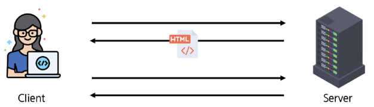


## 🔵 CSR에서의 Routing
- CSR(Client Side Rendering)에서의 routing은 **클라이언트** 측(브라우저)에서 수행
- 클라이언트 측 JavaScript가 새 데이터를 동적으로 가져와 전체 페이지를 다시 로드하지 않음

> 💡 **CSR** : 서버는 뼈대만 주고, 브라우저가 직접 페이지를 그리는 방식

    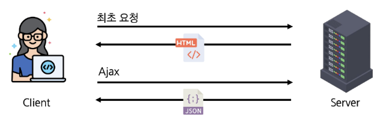


## 🔵 SPA에서 Routing이 없다면
- 유저가 URL을 통한 페이지의 변화를 감지할 수 없음
- 페이지가 무엇을 렌더링 중인지에 대한 상태를 알 수 없음
    - URL이 1개이기 때문에 새로 고침 시 처음 페이지로 되돌아감
    - 링크를 공유할 시 첫 페이지만 공유 가능
- 브라우저의 뒤로 가기 기능을 사용할 수 없음

➤ 페이지는 1개이지만, **주소에 따라 여러 컴포넌트를 새로 렌더링**하여 마치 **여러 페이지를 사용하는 것처럼** 보이도록 해야 함

> 💡 **SPA** : 하나의 페이지 안에서, 내용만 바꿔가며 보여주는 웹 앱


---


# ✅ Vue Router

## 🔵 Vue Router 란?                   
- Vue 공식 라우터 (The official Router for Vue.js)

- Vue.js의 공식 라우팅 라이브러리로, Vue로 만든 SPA에서 페이지 이동 기능을 구현할 때 사용됩니다.
- 페이지를 새로고침하지 않는 링크를 만드는 `<router-link>`와, 현재 URL에 맞는 컴포넌트를 보여주는 `<router-view>`라는 핵심 컴포넌트를 제공합니다.
- 어떤 URL 경로에 어떤 컴포넌트를 보여줄지 정의하기만 하면, Vue Router가 연결해줍니다.


## 🔵 사전 준비 (1/2)
- Vite로 프로젝트 생성 시 Router 추가

    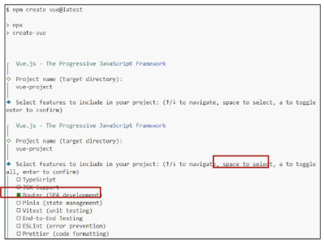


## 🔵 사전 준비 (2/2)
- 서버 실행 후 Router로 인한 프로젝트 변화 확인

    ➤ Home, About 링크에 따라 변경되는 URL과 새로 렌더링 되는 화면

    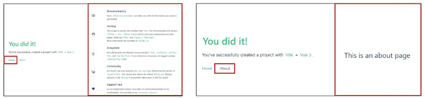

### TIP - Vue 서버 실행하는 방법
1. npm create vue@latest
2. 생성된 프로젝트 폴더로 이동 ($ cd [프로젝트명])
3. 패키지 설치 ($ npm install)
4. 서버 실행 ($ npm run dev)


## 🔵 Vue 프로젝트 구조 변화
1. App.vue 코드 변화

2. router 폴더 신규 생성

3. views 폴더 신규 생성


## 🔵 1. App.vue 코드 변화: RouterLink
- 페이지를 다시 로드 하지 않고 URL을 변경하여 URL 생성 및 관련 로직을 처리
- HTML의 `<a>` 태그를 렌더링
```vue
<!-- App.vue -->
<template>
  <header>
    <div class="wrapper">
      <HelloWorld msg="You did it!" />
      <nav>
        <RouterLink to="/">Home</RouterLink>
        <RouterLink to="/about">About</RouterLink>
      </nav>
    </div>
  </header>

  <RouterView />
</template>
```


## 🔵 1. App.vue 코드 변화: RouterView
- RouterLink URL에 해당하는 컴포넌트를 표시
- 원하는 곳에 배치하여 컴포넌트를 레이아웃에 표시 할 수 있음
```vue
<!-- App.vue -->
<template>
  <header>
    <div class="wrapper">
      <HelloWorld msg="You did it!" />

      <nav>
        <RouterLink to="/">Home</RouterLink>
        <RouterLink to="/about">About</RouterLink>
      </nav>
    </div>
  </header>

  <RouterView />
</template>
```


## 🔵 RouterLink와 RouterView
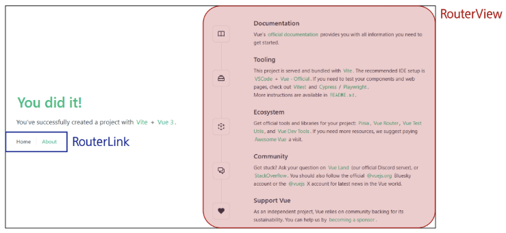


## 🔵 2. router/index.js
- 라우팅에 관련된 정보 및 설정이 작성 되는 곳
- 웹 사이트 여러 페이지들의 주소 목록을 작성(‘/’, ‘home’, ...)
- 각 주소로 접속했을 때, 어떤 Vue 컴포넌트(페이지 화면)를 보여줄 지 연결
    - Django의 urls.py와 같음!

### TIP
- 프로젝트 규모가 작을 때는 index.js 하나로 관리해도 충분합니다.
- 프로젝트 규모가 커질 때는 기능별로 경로 관리를 하고, index.js에서 합치는 방식으로 운영합니다.


## 🔵 3. views
- RouterView 위치에 렌더링 할 컴포넌트를 배치
- 기존 components 폴더와 기능적으로 다른 것은 없으며 **단순 분류의 의미**로 구성됨

※ 일반 컴포넌트와 구분하기 위해 컴포넌트 이름을 View로 끝나도록 작성하는 것을 권장


---


# ✅ Basic Routing

## 🔵 라우팅 기본 동작 순서
1. index.js에 라우터 관련 설정 작성

2. RouterLink에 index에 정의한 주소 값 작성

3. RouterLink 클릭 시 경로와 일치하는 컴포넌트가 RouterView에서 렌더링


## 🔵 라우팅 기본 동작 살펴보기 (1/3)
1. index.js에 라우터 관련 설정 작성(주소, 이름, 컴포넌트)
```js
// index.js
const router = createRouter({
  history: createWebHistory(import.meta.env.BASE_URL),
  routes: [
    {
      path: '/',
      name: 'home',
      component: HomeView,  // HomeView => views 폴더에 저장하고 있는 큰 도화지
    }, …
  ]
})
```


## 🔵 라우팅 기본 동작 살펴보기 (2/3)
2. RouterLink의 ‘to’ 속성으로 index.js에서 정의한 주소 값(path)을 사용
```js
<!-- App.vue -->
<template>
  <header>
    <div class="wrapper">
      <HelloWorld msg="You did it!" />
    </div>

    <nav>
      <RouterLink to="/">Home</RouterLink>
      <RouterLink to="/about">About</RouterLink>
    </nav>
  </header>
  
  {/* components에 설정된 veiw가 보여짐 */}
  <RouterView />
</template>
```


## 🔵 라우팅 기본 동작 살펴보기 (3/3)
3. RouterLink 클릭 시 경로와 일치하는 컴포넌트가 RouterView에서 렌더링 됨
```js
<!-- App.vue -->
<template>
  <header>
    <div class="wrapper">
      <HelloWorld msg="You did it!" />
    </div>

    <nav>
      <RouterLink to="/">Home</RouterLink>
      <RouterLink to="/about">About</RouterLink>
    </nav>
  </header>

  <RouterView />
</template>
```


---


# ✅ Named Routes


## 🔵 path 경로를 그대로 사용하기
- 현재는 index.js에서 입력한 path 경로를 그대로 RouterLink에 사용하고 있음
- 이 방식은 URL 경로를 변경할 때, 해당 경로를 사용한 모든 파일을 일일이 찾아다니며 수정해야 하는 단점이 있음 (유지보수 난이도 증가)
```js
// index.js
const router = createRouter({
  history: createWebHistory(import.meta.env.BASE_URL),
  routes: [ {
      path: '/',
      name: 'home',
      component: HomeView,
    }, {
      path: '/about',
      name: 'about',
      component: () => import('../views/AboutView.vue'),
    }]
})
```
```js
<!-- App.vue -->
<RouterLink to="/">Home</RouterLink>
<RouterLink to="/about">About</RouterLink>
```


## 🔵 Named Routes
- name 속성 값에 경로에 대한 이름을 지정
- 경로에 연결하려면 RouterLink에 v-bind를 사용해 'to' props 객체로 전달 가능
- 하드 코딩된 URL을 사용하지 않아도 되며, 오타를 방지할 수 있음
```js
// index.js
const router = createRouter({
  history: createWebHistory(import.meta.env.BASE_URL),
  routes: [ {
      path: '/',
      name: 'home',
      component: HomeView,
    }, {
      path: '/about',
      name: 'about',
      component: () => import('../views/AboutView.vue'),
    }]
})
```
```js
<!-- App.vue -->
…
<RouterLink :to="{ name: 'home' }">Home</RouterLink>
<RouterLink :to="{ name: 'about' }">About</RouterLink>
…
```

> 💡 **v-bind** : 콜론(:)을 사용해, HTML 속성을 데이터와 실시간으로 연동

> 💡 **props 객체** : 부모 컴포넌트가 자식 컴포넌트에게 데이터를 전달하는 통로


---


# ✅ Dynamic Route Matching


## 🔵 일정한 패턴의 URL 작성을 반복해야 하는 경우
- 주어진 패턴의 여러 경로를 하나의 컴포넌트에 매핑해야 하는 경우는 어떻게 할까요?
- 예) 모든 사용자의 ID를 활용하여 프로필 페이지 URL을 설계
    - user/1
    - user/2
    - user/3

    ➤ 일정한 패턴의 URL 작성을 반복해야 함

➤ 이럴 때 사용하는 것이 바로 Dynamic Route Matching 


## 🔵 Dynamic Route Matching 란?     
- URL의 일부를 변수로 사용하여 경로를 동적으로 매칭
```
- 동적 라우트 매칭은 /user/1, /user/2 처럼 패턴은 같지만 ID 값만 다른 여러 URL을 하나의 라우트 설정으로 처리하는 기능입니다.
- 이를 통해 수백 개의 상품 상세 페이지나 사용자 프로필 페이지를 각각 만들 필요 없이,
하나의 컴포넌트를 재사용하여 효율적으로 개발할 수 있습니다.
```
https://router.vuejs.org/guide/essentials/dynamic-matching.html


## 🔵 매개변수를 사용한 동적 경로 매칭 활용 (1/5)
- 프로필 페이지로 활용하기 위한 컴포넌트 작성하기
- views 폴더 내 UserView 컴포넌트 작성
```js
<!-- UserView.vue -->
<template>
  <div>
    <h1>UserView</h1>
  </div>
</template>
```


## 🔵 매개변수를 사용한 동적 경로 매칭 활용 (2/5)
- 라우터 관련 설정을 하는 router/index.js 파일에 코드 작성
- 매개변수는 콜론(":")으로 표기하고, UserView 컴포넌트를 라우터로 등록
```js
// index.js
import UserView from '../views/UserView.vue'

const router = createRouter({
  routes: [
    {
      path: '/user/:id',
      name: 'user',
      component: UserView
    },
  ]
})
```


## 🔵 매개변수를 사용한 동적 경로 매칭 활용 (3/5)
- 매개변수는 객체의 params 속성의 객체 타입으로 전달
- 단, 객체의 key 이름과 index.js에서 지정한 매개변수 이름이 같아야 함
- UserView 컴포넌트로 이동하기 위한 RouterLink 작성
### ⭐ pk를 전달하는 방식 => params !!!!!

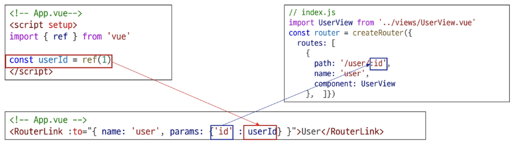


## 🔵 매개변수를 사용한 동적 경로 매칭 활용 (4/5)
- 경로가 일치하면 라우트의 매개변수는 컴포넌트에서 **$route.params**로 참조 가능

➤ 현재 사용자의 id를 출력하기
```html
<!-- UserView.vue -->
<template>
  <div>
    <h1>UserView</h1>
    <h2>{{ $route.params }}번 User 페이지</h2>
    <h2>{{ $route.params.id }}번 User 페이지</h2>
  </div>
</template>
```
결과)
```
UserView
{ "id": "1" }번 User 페이지
1번 User 페이지
```


## 🔵 매개변수를 사용한 동적 경로 매칭 활용 (5/5)
- $route.params 로 template에 바로 작성하는 것보다는
- ⭐ **`useRoute()`** 함수를 사용해 스크립트 내에서 반응형 변수에 할당 후 템플릿에 출력하는 것을 권장
- 템플릿에서 $route를 사용하는 것과 동일
```js
<!-- UserView.vue -->

import { ref } from 'vue'
import { useRoute } from 'vue-router'

const route = useRoute()
const userId = ref(route.params.id)
```
```html
<!-- UserView.vue -->
<template>
  <div>
    <h2>{{ userId }}번 User 페이지</h2>
  </div>
</template>
```


---


# ✅ Nested Routes

## 🔵 애플리케이션의 UI는 여러 레벨 깊이로 중첩된 컴포넌트로 구성되기도 함
- 이 경우, URL 또한 중첩된 컴포넌트 구조에 맞춰 표현할 수 있음
- **Nested Routes**

    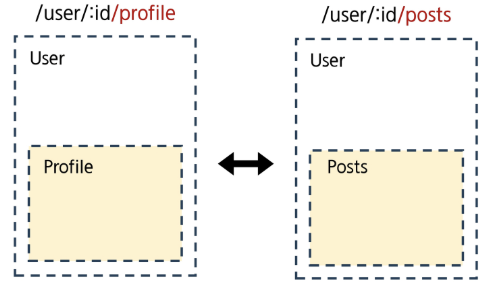


## 🔵 Nested Routes          
- 중첩된 라우팅

```
- 중첩 라우트는 특정 페이지(부모)의 레이아웃은 유지한 채, 그 안의 일부 영역만 다른 내용으로 교체하는 라우팅 방식입니다.
- '사용자' 페이지의 사이드바는 그대로 두고, 주된 내용 영역만 '프로필', '게시글 목록' 등으로 바꿔 보여주는 대시보드 형태의 UI를 만들 때 매우 유용합니다.
```

https://router.vuejs.org/guide/essentials/nested-routes.html#Nested-Routes


## 🔵 중첩된 라우팅 활용 (1/4)
- 유저 프로필 내부에 중첩으로 사용할 컴포넌트 생성
- components 폴더에 UserProfile, UserPosts 컴포넌트 작성 후 라우터 등록
```html
<!-- UserProfile.vue -->

<template>
  <div>
    <h1>UserProfile</h1>
  </div>
</template>
```
```html
<!-- UserPosts.vue -->

<template>
  <div>
    <h1>UserPosts</h1>
  </div>
</template>
```
```js
// index.js

import UserProfile from '@/components/UserProfile.vue'
import UserPosts from '@/components/UserPosts.vue'
```


## 🔵 중첩된 라우팅 활용 (2/4)
- **“children”** 옵션을 사용해 중첩된 라우터에 컴포넌트를 등록
- children 옵션은 배열 형태로 필요한 만큼 중첩 관계를 표현할 수 있음
```js
// index.js
{
  path: '/user/:id',
  component: UserView,
  name: 'user'
  children: [
    // UserProfile은 UserView의 <RouterView> 내부에 렌더링
    { path: 'profile', name: 'userProfile', component: UserProfile},

    // UserPosts는 UserView의 <RouterView> 내부에 렌더링
    { path: 'posts', name: 'userPosts', component: UserPosts}
  ],
},
```


## 🔵 중첩된 라우팅 활용 (3/4)
- 두 컴포넌트(userProfile, userPosts)에 대한 RouterLink 및 RouterView 작성
- Profile과 Posts 링크를 클릭해서 렌더링 결과 확인
```js
// UserView.vue

import { useRoute, RouterLink, RouterView } from 'vue-router'
```
```html
<template>
  <div>
    <RouterLink :to="{ name: 'userProfile' }">Profile</RouterLink>
    <RouterLink :to="{ name: 'userPosts' }">Posts</RouterLink>
    <h1>UserView</h1>
    <h2>{{ userId }}번 User 페이지</h2>
    <hr>
    <RouterView />
  </div>
</template>
```
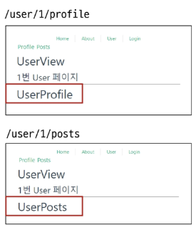


## 🔵 중첩된 라우팅 활용 (4/4)
- 중첩된 Named Routes를 다룰 때는 일반적으로 “하위 경로에만 이름을 지정”
- 이렇게 하면 /user/:id로 이동했을 때 항상 중첩된 경로를 바로 렌더링 가능
    - /user/:id 접속 시 바로 중첩된 경로가 표시 (UserProfile) 
    
    ※ 단, 이전처럼 상위 경로의 이름을 유지하는 구조로 작성해도 무관

```js
// index.js
{
  path: '/user/:id',
  // name: 'user',
  component: UserView,
  children: [
    { path: '', name: 'user', component: UserProfile},
    { path: 'profile', name: 'userProfile', component: UserProfile},
    { path: 'posts', name: 'userPosts', component: UserPosts}
  ],
},
```
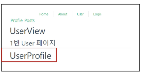


## 🔵 중첩된 라우팅 주의사항
- 컴포넌트 간 부모-자식 관계 관점이 아닌 **“URL에서의 중첩된 관계를 표현”** 하는 관점으로 바라보기
- **자식 라우트의 path는 / 없이 작성**해야, 부모 경로 뒤에 자동으로 연결 됨
- 부모 라우트의 파라미터(:id)는 자식 컴포넌트에서도 바로 접근해서 사용할 수 있음


---


# ✅ Programmatic Navigation


## 🔵 Programmatic Navigation 란?
- `<RouterLink>`(링크)를 사용하는 대신, **JavaScript 코드를 사용**해 페이지를 이동시키는 것

```
- Programmatic Navigation은 사용자가 <router-link>를 클릭하는 대신, JavaScript 코드(로직)를 통해 특정 URL로 이동시키는 기능입니다.
- 뒤에서 배울 router.push()와 같은 메서드를 호출하여, 원하는 경로로 강제 이동시킬 수 있습니다.
```
https://router.vuejs.org/guide/essentials/navigation.html#Programmatic-Navigation


## 🔵 Programmatic Navigation
- 프로그래밍으로 URL 이동하기
- router의 인스턴스 메서드를 사용해 RouterLink로 `<a>` 태그를 만드는 것처럼 프로그래밍으로 네비게이션 관련 작업을 수행할 수 있음
- router의 메서드
    1. router.push()
        - 다른 위치로 이동하기
    2. router.replace()
        - 현재 위치 바꾸기


## 🔵 1. router.push()
- **다른 URL로 이동하는 메서드**
- 새 항목을 history stack에 push하므로 사용자가 브라우저 뒤로 가기 버튼을 클릭하면 이전 URL로 이동할 수 있음
- RouterLink를 클릭했을 때 내부적으로 호출되는 메서드이므로 RouterLink를 클릭하는 것은 router.push()를 호출하는 것과 같음

    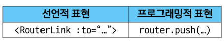


## 🔵 router.push() 활용
- UserView 컴포넌트에서 HomeView 컴포넌트로 이동하는 버튼 만들기
```js
// UserView.vue

import { useRoute, useRouter } from 'vue-router'

const router = useRouter()

const goHome = function () {
  router.push({ name: 'home' })
}
```
```js
<!-- UserView.vue -->

<button @click="goHome">홈으로!</button>
```
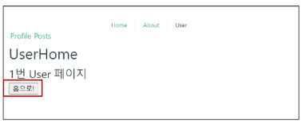


## 🔵 2. router.replace()
- 현재 위치를 바꾸는 메서드
- push 메서드와 달리 history stack에 새로운 항목을 push 하지 않고 다른 URL로 이동
  (=== 이동 전 URL로 뒤로 가기 불가)

  


## 🔵 router.replace() 활용
- UserView 컴포넌트에서 HomeView 컴포넌트로 이동하는 버튼 만들기
```js
// UserView.vue

import { useRoute, useRouter } from 'vue-router'

const router = useRouter()

const goHome = function () {
  router.replace({ name: 'home' })
}
```
```html
<!-- UserView.vue -->

<button @click="goHome">홈으로!</button>
```

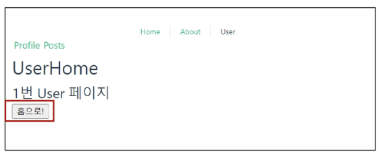


## 🔵 [참고] router.push의 인자 활용
- https://router.vuejs.org/guide/essentials/navigation.html

```js
// literal string path
router.push('/users/alice')

// object with path
router.push({ path: '/users/alice' })

// named route with params to let the router build the url
router.push({ name: 'user', params: { username: 'alice' } })

// with query, resulting in /register?plan=private
router.push({ path: '/register', query: { plan: 'private' } })
```


---


# < route(정보)와 router(행동) >


# ✅ route


## 🔵 useRoute()
- 현재 활성화된 "경로 정보(route)"를 담은 **route 객체**를 반환
- useRoute()는 컴포넌트의 setup 함수나 `<script setup>` 최상단에서만 호출해야 함
```js
<!-- UserView.vue -->

import { ref } from 'vue'
import { useRoute } from 'vue-router'

const route = useRoute()
const userId = ref(route.params.id)
```


## 🔵 route 객체
- 현재 URL 상태를 보여주는 역할
    - route 객체 자체를 통해 페이지 이동(네비게이션)을 직접 제어 할 수는 없음
- 읽기 전용이며, 현재 URL/파라미터쿼리/name/matched 된 라우트 정보 등을 담고 있음
    - 경로 파라미터(route.params), 쿼리(route.query), name(route.name) 등을 통해 현재 페이지 상태를 알 수 있음

- 반응형이며, URL이 변경되면 route 객체도 자동으로 변경됨
    - 예) route.params.id를 참조하고 있다면, URL이 바뀌어 id가 변경될 때 해당 값이 자동으로 반영됨


---


# ✅ route


## 🔵 useRouter()
- 라우터 인스턴스 router 객체를 반환
- useRouter는 **페이지 이동** 등 액션용, useRoute는 경로 정보 읽기용으로 역할이 다름
```js
// UserView.vue

import { useRoute, useRouter } from 'vue-router'

const router = useRouter()

const goHome = function () {
  router.push({ name: 'home' })
}
```


## 🔵 router 객체
- 애플리케이션 전체 라우팅 로직(동작)을 제어할 수 있는 핵심 객체
- 페이지 이동, 네비게이션 관련 메서드 제공
    - router.push('~'), router.replace('~') 등을 통해 **프로그래밍적**으로 라우트를 변경할 수 있음
- **네비게이션 가드 등록**, 히스토리 제어 같은 기능 사용 가능

    ※ 바로 뒤이어 학습 예정


## 🔵 route와 router 정리
- ### useRoute()
    - 현재 라우트 **"상태"**를 읽어오는 전용 객체

- ### useRouter()
    - 라우팅 로직 **"제어"** 및 페이지 이동을 담당하는 인스턴스


구분 | useRoute()로 얻은 객체(route) | useRouter()로 얻은 객체(router)
---- | ----------------------------- | --------------------------------
개념 | 현재 경로(페이지) 정보 읽기용 | 전체 라우팅 관리용 인스턴스
역할 | 현재 상태 확인 | 경로 변경, 이동
주용도 | params, query, name 등 현재 라우트 정보 확인 | push, replace 등으로 라우트 변경 (네비게이션)
예제 | route.params.id 확인 | router.push('/home')로 페이지 이동


---


# ✅ Navigation Guard


## 🔵 Navigation Guard 란?
- Vue router를 통해 **특정 URL에 접근할 때** 다른 URL로 redirect를 하거나
취소하여 **내비게이션을 보호**
```
- 내비게이션 가드는 특정 URL로 이동하기 전이나 후에 실행되는 기능입니다.

- 라우트 전환 전/후에 자동으로 실행되며 사용자의 로그인 상태나 권한을 확인하여, 내비게이션을 허용하거나, 취소하거나, 다른 페이지로 리디렉트시킬 수 있습니다.

- 주로 로그인하지 않은 사용자가 '마이페이지'에 접근하는 것을 막고 로그인 페이지로 보내는 등, 인증 기반의 라우팅 로직을 구현할 때 사용됩니다.
```
https://router.vuejs.org/guide/advanced/navigation-guards.html


## 🔵 Navigation Guard 종류 (범위로 나눔)

1. Globally (전역 가드)
    - 애플리케이션 전역에서 **모든** 라우트 전환에 적용되는 가드
    - url 전체

2. Per-route (라우터 가드)
    - **특정 라우트**에만 적용되는 가드
    - url 1개

3. In-component (컴포넌트 가드)
    - **컴포넌트 내**에서만 적용되는 가드


---


# ✅ Globally Guard


## 🔵 1. Globally Guard(전역 가드)
- 애플리케이션 전역에서 동작하는 가드      

    ※ 작성 위치: index.js

- Globally Guard 종류
    1. beforeEach()
    2. beforeResolve()
    3. afterEach()


## 🔵 1. Globally Guard: beforeEach() 구조 (1/2)
- 다른 URL로 이동하기 직전에 실행되는 함수(Global Before Guards)
```js
router.beforeEach((to, from) => {
  …
  return false 또는 return { name: 'About' }
})
```
- 모든 가드의 콜백 함수는 **2개의 인자**를 받음
    - to : **이동 할 URL** 정보가 담긴 Route 객체
    - from : **현재 URL** 정보가 담긴 Route 객체


## 🔵 1. Globally Guard: beforeEach() 구조 (2/2)
- 다른 URL로 이동하기 직전에 실행되는 함수(Global Before Guards)
```js
router.beforeEach((to, from) => {
  …
  return false 또는 return { name: 'About' }
})
```
- 선택적으로 다음 값 중 하나를 반환
    ### 1. false
    - 현재 내비게이션을 취소
    - 브라우저 URL이 변경된 경우(사용자가 수동으로 또는 뒤로가기 버튼을 통해) ‘from’ 경로의 URL로 재설정
    ### 2. Route Location
    - router.push()를 호출하는 것처럼 경로 위치를 전달하여 다른 위치로 redirect
    - return이 없다면 자동으로 ‘to’ URL Route 객체로 이동


## 🔵 1. Globally Guard: beforeEach() 예시
- 전역 가드 beforeEach 작성
- HomeView에서 UserView로 이동 했을 때 각 인자 값 출력 확인하기

➤ **to**에는 **이동할 URL**인 user 라우트에 대한 정보가, 

➤ **from**에는 **현재 URL**인 home 라우트에 대한 정보가 들어있음

```js
// index.js
router.beforeEach((to, from) => {
  console.log(to)
  console.log(from)
})

export default router
```


## 🔵 1. Globally Guard: beforeEach() 활용
- “Login이 되어있지 않다면 페이지 진입을 막고 Login 페이지로 이동시키기”
- 만약 로그인이 되어있지 않고(1), 이동하는 주소 이름이 login이 아니라면(2) login 페이지로 redirect
```html
<!-- LoginView.vue -->
<template>
  <div>
    <h1>Login View</h1>
  </div>
</template>
```
```js
// index.js
router.beforeEach((to, from) => {
  const isAuthenticated = false

  if (!isAuthenticated && to.name !== 'login') {
    console.log('로그인이 필요합니다.')
    return { name: 'Login' }
  }
})
```
```js
<!-- App.vue -->
<RouterLink :to="{ name: 'login' }">Login</RouterLink>
```
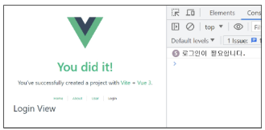


## 🔵 2. Globally Guard: beforeResolve()
- beforeEach와 모든 컴포넌트 단위 가드가 실행된 후, 내비게이션이 확정되기 직전에 호출

- 모든 비동기 컴포넌트가 로드되고, 모든 가드가 통과된 상태에서 마지막으로 무언가를 확인하고 싶을 때 사용

- 주요 사용 예시
    - 페이지에 진입하기 전에, 사용자의 권한과 관련된 데이터를 미리 가져오는 등의 작업에 사용

- 비교적 사용 빈도가 beforeEach보다 낮음


## 🔵 3. Globally Guard: afterEach()
- 내비게이션이 완전히 확정된 후, 즉 URL이 변경되고 화면 렌더링이 끝난 뒤에 호출
- 이미 이동이 완료된 상태이므로, 내비게이션을 중단시키거나 변경할 수 없음
- 주요 사용 예시
    - 페이지 이동 기록을 로깅(logging)하거나, 이동한 페이지에 맞춰 문서의 제목(document.title)을 변경하는 등 **후처리 작업**에 적합


---


# ✅ Per-route Guard


## 🔵 1. Per-route Guard(라우터 가드)
- 특정 라우트(경로)에 진입할 때만 실행되도록 라우트 설정 객체에 직접 정의하는 가드
- 주로 **beforeEnter** 가드를 많이 사용

    ※ 작성 위치: index.js의 각 routes


## 🔵 2. Per-route Guard: beforeEnter()
- 특정 route에 진입했을 때만 실행되는 함수
```js
routes: [
  {
    path: '/user/:id',
    name: 'user',
    component: UserView,
    beforeEnter: (to, from) => {
      ...
      return false
    }
  },
  ...
]
```
- 단순히 URL의 매개변수나 쿼리 값이 변경될 때는 실행되지 않고, **다른 URL에서 탐색해 올 때만 실행**됨


## 🔵 2. Per-route Guard: beforeEnter() 예시
- 라우터 가드 beforeEnter 작성
- HomeView에서 LoginView로 이동 후 각 인자 값 출력 확인하기
- to에는 이동할 URL인 login 라우트 정보,
from에는 현재 URL인 home 라우트 정보가 있음
- 다른 경로에서 login 라우트를 탐색했을 때 실행된 것
```js
// index.js
{
  path: '/login',
  name: 'login',
  component: LoginView,
  beforeEnter: (to, from) => {
    if (isAuthenticated === true) {
      console.log('이미 로그인 상태입니다.')
      return { name: 'home' }
    }
  }
}
```


## 🔵 2. Per-route Guard: beforeEnter() 활용
- 이미 로그인 한 상태라면 LoginView 진입을 막고 HomeView로 이동시키기
- 로그인 상태라면 HomeView로 이동, 로그인 상태가 아니라면 LoginView로 이동
    ※ 전역 가드 beforeEach 관련 코드는 주석 처리 후 진행

```js
// index.js

const isAuthenticated = true

const router = createRouter({
  routes: [
    {
      path: '/login',
      name: 'login',
      component: LoginView,
      beforeEnter: (to, from) => {
        if (isAuthenticated === true) {
          console.log('이미 로그인 상태입니다.')
          return { name: 'home' }
        }
      }
    },
    ...
  ]
})
```
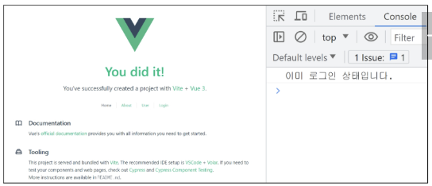


---


# ✅ In-component Guard


## 🔵 3. In-component Guard(컴포넌트 가드)
- 특정 컴포넌트 내에서만 동작하는 가드
    
    ※ 작성 위치: 각 컴포넌트의 `<script>` 내부

- In-component Guard 종류
    - **onBeforeRouteLeave()**
        - 현재 라우트에서 다른 라우트로 이동하기 전에 실행
        => 사용자가 현재 페이지를 떠나는 동작에 대한 로직 처리

    - **onBeforeRouteUpdate()**
        - 이미 렌더링 된 컴포넌트가 같은 라우트 내에서 업데이트 되기 전에 실행

        => 라우트 업데이트 시 추가적인 로직을 처리


## 🔵 3. In-component Guard: onBeforeRoute**Leave** 활용
- 사용자가 UserView를 떠날 시 팝업 창 출력하기
```js
<!-- UserView.vue -->

import { onBeforeRouteLeave } from 'vue-router'

onBeforeRouteLeave((to, from) => {
  const answer = window.confirm('정말 떠나실 건가요?')
  if (answer === false) {
    return false
  }
})
```
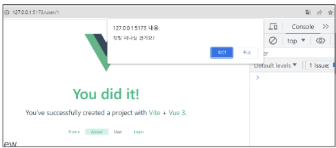


## 🔵 3. In-component Guard: onBeforeRoute**Update** 활용 (1/2)
- UserView 페이지에서 다른 id를 가진 User의 UserView 페이지로 이동하기
- 같은 라우트 내에서 업데이트 되는 경우 (/user/1 → /user/100)
```js
<!-- UserView.vue -->
<button @click="routeUpdate">100번 유저 페이지</button>
```
```js
<!-- UserView.vue -->
import { onBeforeRouteUpdate } from 'vue-router'

const routeUpdate = function () {
  router.push({ name: 'user', params: { id: 100 } })
}

onBeforeRouteUpdate((to, from) => {
  userId.value = to.params.id
})
```
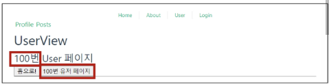


## 🔵 3. In-component Guard: onBeforeRouteUpdate 활용 (2/2)
- 만약 onBeforeRouteUpdate를 사용하지 않았다면?
    - onBeforeRouteUpdate에서 userId를 변경하지 않으면 userId는 갱신되지 않음
    
        (컴포넌트가 되었기 때문)
```vue
<!-- UserView.vue -->

// onBeforeRouteUpdate((to, from) => {
//   userId.value = to.params.id
// })
```


## 🔵 Navigation Guard 정리
1. Globally (전역 가드)
    - 애플리케이션 전역에서 동작
    - 작성위치: **index.js**

2. Per-route (라우터 가드)
    - 특정 route에서만 동작
    - 작성위치: **index.js의 각 routes**

3. In-component (컴포넌트 가드)
    - 특정 컴포넌트 내에서만 동작
    - 작성위치: **각 컴포넌트의 script**


---


# ✅ Lazy Loading Routes
- Vue 애플리케이션 첫 빌드 시 해당 컴포넌트를 로드하지 않고, “해당 경로를 **처음으로 방문할 때** 컴포넌트를 로드” 하는 것

    => 빌드할 때 처음부터 모든 컴포넌트를 준비하면 컴포넌트의 크기에 따라 페이지 로드 시간이 길어질 수 있기 때문

```js
// index.js

{
  path: '/about',
  name: 'about',
  // route level code-splitting
  // this generates a separate chunk (About.[hash].js) for this route
  // which is lazy-loaded when the route is visited.
  component: () => import('../views/AboutView.vue')
},
```


---


# 📚 총 정리

## 🔑 핵심 키워드
| 개념          | 설명                   | 예시                              |
| ----------- | -------------------- | ------------------------------- |
| Vue 라우터     | Vue의 공식 라우팅 라이브러리    | URL에 따라 다른 컴포넌트 표시              |
| RouterLink  | 페이지 이동을 위한 링크 컴포넌트   | `<RouterLink to="/about">`      |
| RouterView  | 현재 경로의 컴포넌트를 렌더링     | `<RouterView />`                |
| 이름 있는 라우트   | 경로 대신 이름으로 라우트를 연결   | `:to="{ name: 'home' }"`        |
| 동적 라우팅      | URL 일부를 변수로 사용해 매칭   | `path: '/users/:id'`            |
| 프로그래밍 방식 이동 | JS 코드로 페이지를 이동시키는 기능 | `router.push({ name: 'home' })` |
| 내비게이션 가드    | URL 접근 제어 및 리다이렉트    | `router.beforeEach((to, from))` |


## 📝 요약 및 정리

### 라우팅
- 사용자가 접속한 URL 주소에 따라 적절한 페이지(컴포넌트)를 보여주는 과정
- SPA(Single Page Application)에서의 라우팅
    - SPA는 단일 페이지로 구성되므로, 페이지 이동 시 새로고침 없이 화면을 동적으로 교체하기 위해 클라이언트 측 라우팅은 필수
- Vue Router
    - Vue.js의 공식 라우팅 라이브러리로, SPA에서 페이지 이동 기능을 구현함


### Vue Router
- Vue.js의 공식 라우팅 라이브러리로, SPA에서 페이지 이동 기능을 구현함
- RouterLink
    - 페이지를 새로고침하지 않고 URL을 변경하는 링크를 생성
    - `<a>` 태그로 렌더링
- RouterView
    - 현재 URL 경로와 일치하는 컴포넌트를 렌더링하는 자리 표시자 역할
- 라우터 설정 (router/index.js)
    - 각 URL 경로(path)에 어떤 컴포넌트(component)를 보여줄지 정의하는 설정 파일


### 다양한 라우팅 기법 

- Named Routes
    - 경로에 name을 부여하고, path 대신 이 이름을 사용해 라우트를 연결하는 방식
    - `:to="{ name: 'routeName' }"` URL 경로가 변경되어도 링크 코드를 수정할 필요가 없어 유지보수에 유리

- Dynamic Route Matching
    - :/user/:id와 같이 URL 경로의 일부를 변수(파라미터)로 사용하여, 여러 URL을 하나의 컴포넌트에 연결
    - 컴포넌트 내에서는 useRoute() 훅을 사용해 route.params.id와 같이 파라미터 값 가져오기 가능

- Programmatic Navigation
    - `<RouterLink>`를 클릭하는 대신 JavaScript 코드 내에서 페이지를 이동시키는 기능
    - useRouter() 훅으로 라우터 인스턴스를 가져온 후, router.push({ name: 'routeName' })와 같은 메서드를 호출하여 사용

- Nested Routes
    - 라우트 설정에서 children 옵션을 사용하여 라우트를 중첩
    - 부모 컴포넌트의 `<RouterView>` 내부에 자식 컴포넌트가 렌더링되어, 대시보드 같은 UI를 구성할 때 유용


### 내비게이션 가드 (Navigation Guards)
- 특정 URL로의 이동을 허용하거나 취소하고, 다른 경로로 리디렉션하는 등 라우팅을 제어하는 기능
- 주로 사용자 인증 여부를 확인할 때 사용

- 전역 가드 (beforeEach)
    - 모든 라우트 변경이 일어나기 직전에 실행되는 가드
    - router/index.js 파일에 `router.beforeEach((to, from) => { ... }) `형태로 등록
    - to는 이동할 라우트 객체, from은 현재 라우트 객체를 의미
    - 콜백 함수 내에서 조건에 따라 `return { name: 'login' }`과 같이 다른 페이지로 리디렉션시키거나, `return false`로 이동 취소 가능


---


### 웹사이트에 Home과 About 페이지를 만들려고 합니다.
### SPA(Single Page Application)에서는 어떻게 페이지를 나눌 수 있을까요?

```js
// 1. URL 주소와 보여줄 컴포넌트를 짝지어 정의합니다.
const routes = [
  { path: '/', name: 'home', component: HomeView },
  { path: '/about', name: 'about', component: AboutView },
]
```
```html
<!-- 2. 라우터링크에 따른 경로를 설정해주고, View로 화면을 구성합니다. -->
<template>
  <nav>
    <RouterLink to="/">Home</RouterLink>
    <RouterLink to="/about">About</RouterLink>
  </nav>
  <RouterView />
</template>
```
