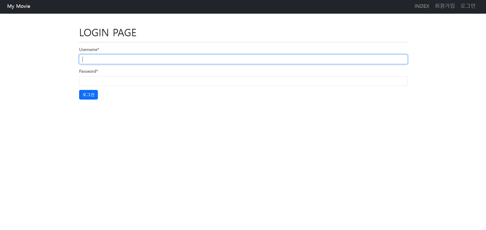

# 🎬 06-pjt : 프로젝트 기획과 협업(영화)
## 📌 프로젝트 개요

이 프로젝트는 영화 정보를 한눈에 조회하고, 사용자 간 의견을 나눌 수 있는 커뮤니티형 플랫폼을 목표로 제작되었습니다.
웹 프레임워크로는 Django를 사용하여 영화 데이터의 등록·수정·삭제 기능을 포함한 CRUD 시스템과 사용자 인증 기반의 **댓글 관리 기능(생성·삭제)**을 완성했습니다.

---

## ⚙️ 주요 기능

| 구분          | 기능명                     | 설명                                                |
| ----------- | ----------------------- | ------------------------------------------------- |
| Model Class | 영화 및 댓글 데이터 관리          | 영화 정보와 댓글 데이터를 Django Model로 정의하여 데이터베이스에 저장 및 관리 |
| Form Class  | 사용자 입력 기능               | 영화 및 댓글 데이터를 입력할 수 있는 Django Form 구현              |
| View 함수     | 영화 목록 (index)           | 전체 영화 리스트를 조회할 수 있는 기능 구현                         |
| View 함수     | 영화 등록 (create)          | 새 영화 정보를 데이터베이스에 추가할 수 있는 기능 구현                   |
| View 함수     | 영화 상세보기 (detail)        | 선택한 영화의 상세 정보를 조회하는 기능 구현                         |
| View 함수     | 영화 수정 (update)          | 등록된 영화 정보를 수정할 수 있는 기능 구현                         |
| View 함수     | 영화 삭제 (delete)          | 등록된 영화 정보를 삭제할 수 있는 기능 구현                         |
| View 함수     | 댓글 등록 (comments_create) | 영화에 대한 댓글을 작성하고 저장하는 기능 구현                        |
| View 함수     | 댓글 삭제 (comments_delete) | 자신이 작성한 댓글을 삭제할 수 있는 기능 구현                        |
| AI 활용   | 정보 생성 및 저장              | AI 기반으로 감독 관련 정보를 자동 생성하는 기능 구현     |

---

## 📋 구현 기능 및 기술

### 메인 페이지

* 등록된 영화 목록을 카드 형태로 확인 가능
* 각 영화 클릭 시 상세 페이지로 이동
* 로그인 상태에 따라 상단 Navbar 메뉴(로그인/회원가입 vs 회원정보/로그아웃)가 동적으로 변경

---

### 영화 상세 페이지

* 단일 영화 데이터를 상세히 보여주는 페이지
* 제목, 줄거리, 장르, 평점, 감독 외에 AI로 생성된 감독 소개 및 대표작 목록 표시
* 수정 / 삭제 버튼 제공
* 영화 상세 페이지 하단에 위치한 댓글 영역 / 댓글 전체 보기 및 작성 폼 제공
* empty 태그를 통해 댓글이 없을 경우 문구 출력
* request.user == comment.user를 통해 자신의 댓글일 경우 삭제 버튼 노출

---

### 댓글 작성

* 로그인하지 않은 사용자가 댓글을 작성하려고 하면 `@login_required` 데코레이터에 의해 자동으로 로그인 페이지로 리다이렉트

* /accounts/login/?next=/movies/2/comments/create/ 형태의 URL로 이동
* 댓글 작성자(user)와 해당 댓글이 달린 영화(movie)가 함께 저장
* 댓글 작성시 ~~ 로직을 통해 데이터베이스에 저장됨 
* 댓글이 데이터베이스에 저장된 뒤 해당 영화의 상세 페이지(movies:detail)로 리다이렉트되어 작성된 댓글을 즉시 확인

---

### 댓글 삭제 

* request.user == comment.user 조건문을 통해 댓글 작성자 본인만 삭제할 수 있도록 구현
* 삭제 요청이 들어오면 해당 댓글이 삭제된 뒤 다시 영화 상세 페이지로 리다이렉트

---

### HTTP 메서드 및 접근 제어 데코레이터

`@login_required`
`@require_safe`
`@require_http_methods(["POST"])`
`@require_http_methods(["GET", "POST"])`

* 데코레이터를 활용하여 HTTP 요청 방식에 따라 허용되는 동작을 명확히 구분
* 인증된 사용자만이 데이터 변경이 가능한 구조를 구현

## 💡 학습한 내용

1. 댓글 Create/Delete 구현
2. HTTP 메서드 & 접근 제어 데코레이터

---

## 🤔 어려웠던 부분

* form.save(commit=False)로 우선 DB 저장을 미루고, 그 사이에 외래키(comment.movie, comment.user) 값을 직접 지정하고, 이후 save()를 호출해 실제 DB에 반영하는 순서를 이해하는 데 시간이 조금 걸렸다.

---

## 🌱 새로 배운 것

* `form.save(commit=False)`로 임시 객체를 생성해 외래키(`comment.movie`, `comment.user`)를 지정한 뒤 `save()`로 실제 DB에 저장하는 과정을 익혔습니다.  
* 댓글 작성/삭제 기능을 구현하며, `@require_POST`와 `@login_required` 같은 데코레이터로 요청 방식을 제한하고 접근 권한을 제어하는 방법을 배웠습니다.  
* 잘못된 요청이나 비인증 사용자의 접근을 방지하기 위해 HTTP 메서드 제어와 인증 절차를 함께 설계해야 함을 이해했습니다.

---

## ✨ 느낀 점

* 단순히 댓글을 저장하는 기능을 넘어서, 요청의 흐름과 데이터의 안전한 처리 순서를 설계하는 것이 중요하다는 걸 느꼈습니다.  
* `@require_POST`나 `@login_required`를 직접 적용해 보니, 실제 서비스 개발에서 보안과 접근 제어가 얼마나 중요한지 체감할 수 있었습니다.

