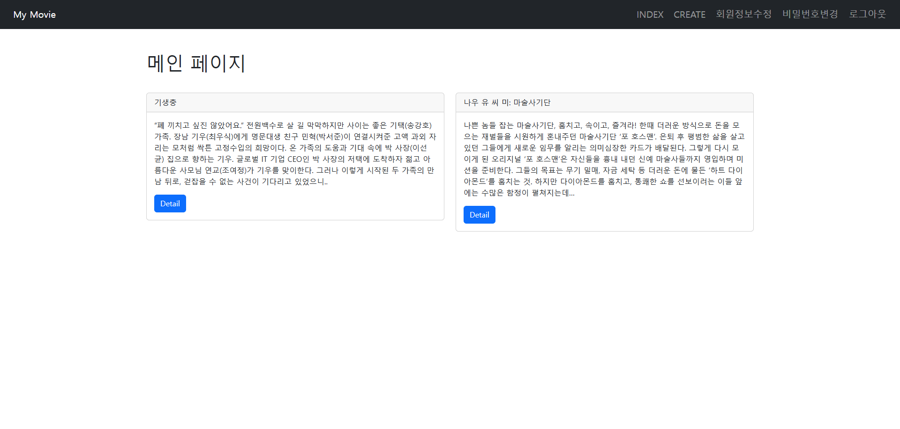
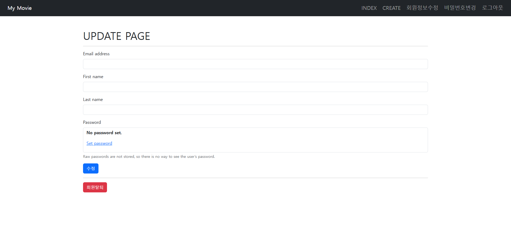
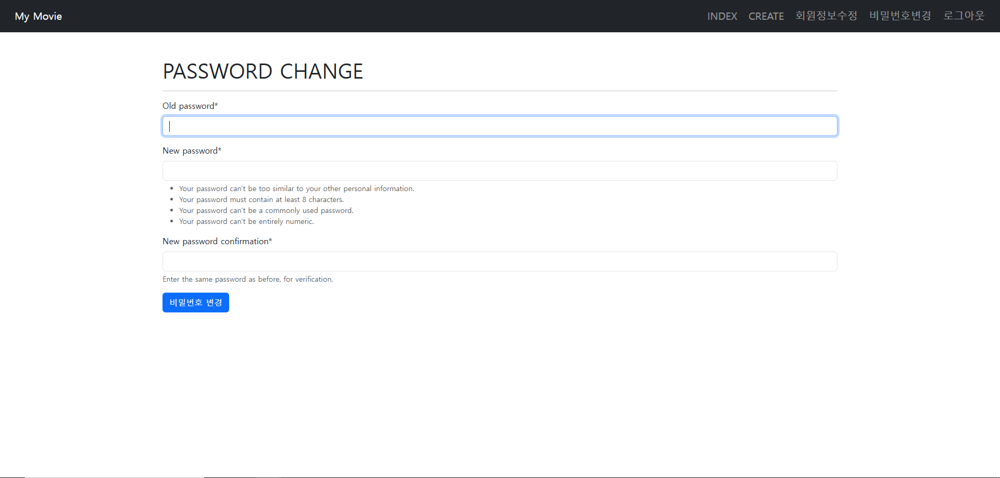
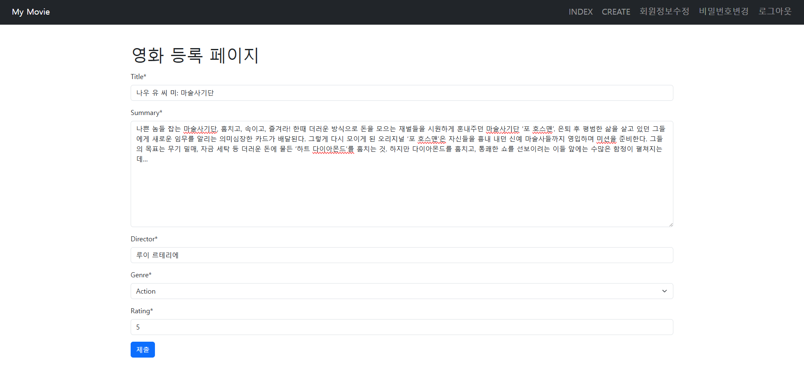
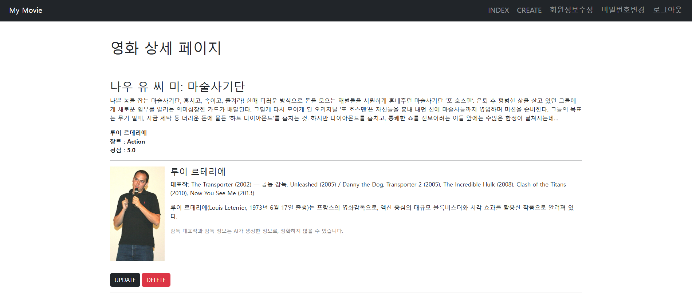
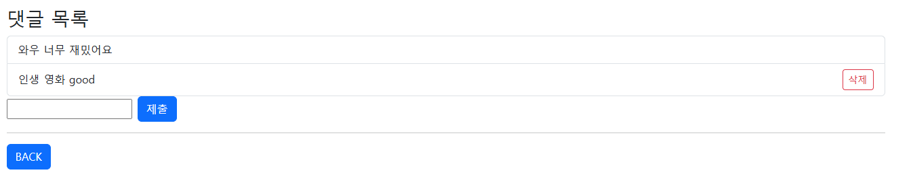
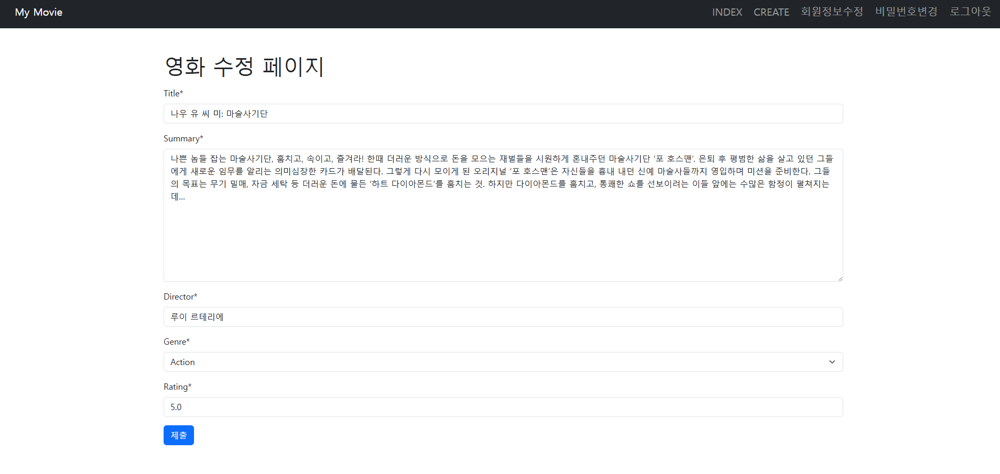

# 🎬 06-pjt : 프로젝트 기획과 협업(영화)
## 📌 프로젝트 개요

사용자들이 영화 정보를 조회하고, 자신의 의견을 댓글로 남기며 소통할 수 있는 영화 커뮤니티 플랫폼을 구축하는 것이 목표입니다.
Django 프레임워크를 기반으로 하여 영화 데이터 관리, 댓글 CRUD 기능, 사용자 중심의 인터페이스를 구현하고, 이를 통해 영화 관련 커뮤니티 활동을 효율적으로 지원합니다.

---

## ⚙️ 주요 기능

| 구분          | 기능명                     | 설명                                                |
| ----------- | ----------------------- | ------------------------------------------------- |
| Model Class | 영화 및 댓글 데이터 관리          | 영화 정보와 댓글 데이터를 Django Model로 정의하여 데이터베이스에 저장 및 관리 |
| Form Class  | 사용자 입력 기능               | 영화 및 댓글 데이터를 입력할 수 있는 Django Form 구현              |
| View 함수     | 영화 목록 (index)           | 전체 영화 리스트를 조회할 수 있는 기능 구현                         |
| View 함수     | 영화 등록 (create)          | 새 영화 정보를 데이터베이스에 추가할 수 있는 기능 구현                   |
| View 함수     | 영화 상세보기 (detail)        | 선택한 영화의 상세 정보를 조회하는 기능 구현                         |
| View 함수     | 영화 수정 (update)          | 등록된 영화 정보를 수정할 수 있는 기능 구현                         |
| View 함수     | 영화 삭제 (delete)          | 등록된 영화 정보를 삭제할 수 있는 기능 구현                         |
| View 함수     | 댓글 등록 (comments_create) | 영화에 대한 댓글을 작성하고 저장하는 기능 구현                        |
| View 함수     | 댓글 삭제 (comments_delete) | 자신이 작성한 댓글을 삭제할 수 있는 기능 구현                        |
| AI 활용   | 정보 생성 및 저장              | AI 기반으로 감독 관련 정보를 자동 생성하는 기능 구현     |

---

## 📋 구현 기능 및 기술

### 메인 페이지

* 등록된 영화 목록을 카드 형태로 확인 가능
* 각 영화 클릭 시 상세 페이지로 이동
* 로그인 상태에 따라 상단 Navbar 메뉴(로그인/회원가입 vs 회원정보/로그아웃)가 동적으로 변경

---

### 회원관련 페이지 

* 회원가입 페이지, 로그인 페이지, 회원 수정 페이지 비밀번호 변경 페이지 구현
* 아이디/비밀번호 검증 후 세션 생성

---

### 영화 등록 페이지 (AI 활용)

* 로그인 상태에서 영화 데이터를 등록할 수 있는 페이지
* `ModelForm`을 사용하여 영화 제목, 줄거리, 감독 입력
* 저장 시 Wikipedia API + OpenAI API를 활용하여 감독 정보와 대표작 자동 생성 → DB에 함께 저장

---

### 영화 상세 페이지

* 단일 영화 데이터를 상세히 보여주는 페이지
* 제목, 줄거리, 장르, 평점, 감독 외에 AI로 생성된 감독 소개 및 대표작 목록 표시
* 수정 / 삭제 버튼 제공
* 영화 상세 페이지 하단에 위치한 댓글 영역 / 댓글 전체 보기 및 작성 폼 제공
* empty 태그를 통해 댓글이 없을 경우 문구 출력
* request.user == comment.user를 통해 자신의 댓글일 경우 삭제 버튼 노출

---

### 영화 수정 페이지

* 기존 영화 데이터를 수정할 수 있는 페이지
* 입력된 영화 정보가 미리 채워진 상태로 Form 출력
* 수정 완료 시 상세 페이지로 이동 

---

## 💡 학습한 내용

1. Django 인증 시스템의 구조와 적용 과정
2. Django 모델 설계 및 관계형 데이터 구조 이해
3. ModelForm과 ORM을 활용한 데이터 처리

---

## 🤔 어려웠던 부분

* choices를 사용할 때도, 실제 DB에 저장되는 값과 화면에 표시되는 값이 다르다는 구조를
처음에는 어떻게 지정하고 활용해야 하는지 잘 몰랐습니다.
* DecimalField를 사용할 때 max_digits와 decimal_places를 어떤 식으로 지정해야 평점이 올바르게 저장되는지 초반에는 잘 몰랐습니다.

---

## 🌱 새로 배운 것

* 1:N 관계(다대일 관계)의 본질을 실습을 통해 체득했습니다.
— 하나의 영화에 여러 댓글이 달릴 수 있고,
하나의 사용자가 여러 댓글을 작성할 수 있는 구조를 실제 모델 관계로 구현했습니다.
* 필드 제약 조건 설계 능력 향상
— choices, max_length, decimal_places, default 등 다양한 필드 제약 조건을 설계하며
입력 데이터의 품질과 일관성을 보장하는 방법을 익혔습니다.

---

## ✨ 느낀 점

* 단순히 기능을 구현하는 것을 넘어 “왜 이런 필드 타입을 선택해야 하는가”와 “관계형 구조를 어떻게 표현할 것인가”를 고민하는 과정이 실제 서비스 개발과 가까운 경험이었습니다.

